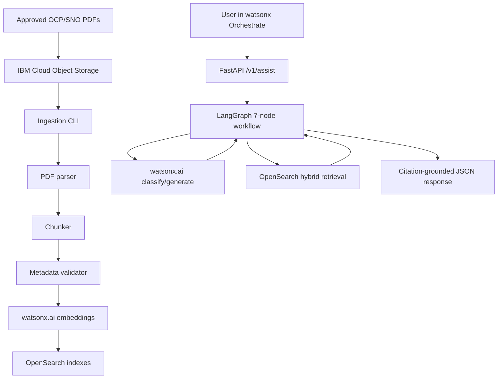

# Final Internship Project Report: OpenShift and SNO Support Copilot

**Project:** OpenShift and Single Node OpenShift Technical Support Copilot  
**Repository:** `Vaibhav-J20/it-help-desk`  
**Current branch/state:** `main`, after Day 10 integration merge  
**Final integration PR:** PR #5, `integration/day10-final` into `main`  
**Final reported evaluation:** 38/40 gold questions passed, 95 percent pass rate  
**Primary audience:** Internship managers, technical stakeholders, and the student developer who needs to explain the project confidently

---

## 1. Executive Summary

This project is a citation-grounded AI support backend for Red Hat OpenShift Container Platform (OCP) and Single Node OpenShift (SNO). It lets a user ask a technical question in natural language and receive an answer that is grounded in approved PDF documentation, with citations that identify the document title, OpenShift version, pages, section path, document ID, and chunk ID used as evidence.

The system is designed for an enterprise support use case. It is not a general chatbot and it is not a free-form web-search assistant. It only answers from a controlled knowledge base built from approved OpenShift/SNO PDFs. If the question is vague, it asks for clarification. If the question is outside the project scope, it refuses cleanly. If the retrieved evidence is not strong enough, it returns `INSUFFICIENT_EVIDENCE` instead of guessing.

In business terms, this proof of concept demonstrates how IBM watsonx.ai, OpenSearch, IBM Cloud Object Storage, FastAPI, and IBM watsonx Orchestrate can be connected into a reliable support workflow for technical documentation. The major value is reducing the time engineers spend searching long PDF manuals while preserving traceability back to official source documents.

In technical terms, this is a retrieval-augmented generation system. The backend ingests PDFs from IBM Cloud Object Storage, parses them into pages, chunks the page text, embeds each chunk with watsonx.ai, stores the chunks in OpenSearch, retrieves relevant evidence using hybrid BM25 plus vector search, and uses watsonx.ai generation to compose an answer with citations. The answer is then validated before returning to the user.

---

## 2. Non-Technical Sales Explanation

Imagine an IBM support engineer receives an OpenShift question such as:

```text
What DNS records are required before starting SNO 4.16 installation?
```

Without this project, the engineer may need to manually search multiple OpenShift PDF guides, check the correct version, inspect pages, and then write a response. That takes time and risks using the wrong version of documentation.

With this project, the engineer can ask the question in a chatbot-style interface. The system searches only the approved OpenShift/SNO documentation, finds the most relevant passages, and returns a concise answer with citations. The citations prove where the answer came from.

The strongest business points are:

- It speeds up technical support by searching long documentation automatically.
- It reduces hallucination risk because answers must be grounded in approved documents.
- It improves auditability because every answer includes citations.
- It supports version-sensitive technical answers, such as OCP 4.14 versus OCP 4.16.
- It safely handles unsupported questions by refusing or asking for clarification.
- It is built on IBM-aligned technology: watsonx.ai, IBM Cloud Object Storage, and watsonx Orchestrate.

This is a proof of concept, not a finished production platform. However, it demonstrates the core pattern needed for an enterprise support assistant: controlled content, controlled retrieval, controlled generation, and controlled refusal behavior.

---

## 3. One-Sentence Stakeholder Pitch

This project is an IBM watsonx-powered OpenShift support copilot that answers user questions from an approved PDF knowledge base with page-level citations, while refusing to guess when the question is unsupported, vague, or not backed by evidence.

---

## 4. Problem Statement

OpenShift documentation is large, technical, and version-sensitive. A support engineer often needs to answer questions where the correct response depends on:

- The OpenShift version.
- The deployment type, such as SNO, standard, or compact.
- The component, such as DNS, networking, storage, authentication, API server, or operators.
- Whether the user is asking for a factual answer, troubleshooting guidance, a summary, or something outside the supported domain.

Traditional document search can return long pages or many unrelated matches. A normal chatbot can answer fluently but may hallucinate. This project combines search and generation in a controlled way so the final answer is both useful and traceable.

The main product problem is:

```text
How can we help users get reliable OpenShift/SNO answers quickly while making sure every answer is backed by approved documentation?
```

---

## 5. What Was Delivered

The final merged project includes:

- A FastAPI backend with `/v1/assist`, `/healthz`, `/readyz`, and OpenAPI documentation.
- API key authentication using the `X-API-Key` header.
- Pydantic request and response models that define the API contract.
- A bounded 7-node LangGraph workflow.
- watsonx.ai integration for classification, embeddings, and answer generation.
- OpenSearch hybrid retrieval using BM25 keyword search and vector kNN search.
- Reciprocal Rank Fusion (RRF) to merge BM25 and vector results.
- A PDF ingestion pipeline that reads from IBM Cloud Object Storage or local files.
- PDF parsing using `pdfminer.six`.
- Chunking with overlap and page tracking.
- Metadata validation against a controlled taxonomy.
- OpenSearch indexing for chunk documents and document registry records.
- A 40-question gold evaluation dataset.
- Evaluation scripts and documented results.
- OpenAPI spec for watsonx Orchestrate tool import.
- Dockerfile and IBM Code Engine deployment guide.
- Developer prompts, restart guide, session log, README, and this final report.

The final demo state showed:

- FastAPI was reachable.
- OpenSearch was reachable.
- watsonx.ai embeddings were reachable.
- The ngrok public URL was live.
- The sample DNS question returned `ANSWERED` with citations.
- Ambiguous questions returned `NEEDS_CLARIFICATION`.
- Out-of-scope questions returned `OUT_OF_SCOPE`.

---

## 6. Current Final Status

### Git Status

The Day 10 integration work was merged into `main`.

Important commits:

- `60ac48a`: Merge pull request #5 from `integration/day10-final`
- `657786b`: Merge Day 10 final integration
- `239f8b6`: Update explainer with Day 9 summary
- `dbb81df`: Complete Day 9 ingestion and eval fixes
- `04c8c1d`: Day 10 demo dry run passed, eval 38/40

Anush's older PR from `feature/dev-b-ingestion` became redundant after the integration branch merged both developers' work. GitHub closed it automatically because the final integration merge already included its changes.

### Runtime Status From Demo

The readiness endpoints returned:

```json
{"status":"ready","opensearch":true,"watsonx":true}
```

This means the API process was running and could connect to both OpenSearch and watsonx.ai embedding configuration.

### Evaluation Status

Final evaluation:

```text
38/40 passed
95 percent pass rate
Target was 70 percent or higher
```

Known failures:

- `q026`: Cross-version comparison between OCP 4.14 and OCP 4.16 SNO installation.
- `q028`: Cross-version comparison between OCP 4.14 and OCP 4.16 hardware requirements.

These failures are not basic hallucination failures. They are future-work retrieval limitations: the current retrieval path works well for single-version questions but does not yet intentionally gather and compare evidence from two different versioned documents in one answer.

---

## 7. High-Level Architecture

The system has two big pipelines:

1. The ingestion pipeline, which builds the knowledge base.
2. The question-answering pipeline, which answers user questions from the knowledge base.



### Main Components

| Component | Technology | Purpose |
|---|---|---|
| User interface | IBM watsonx Orchestrate | The planned chatbot interface for users |
| API backend | FastAPI | Receives user questions and returns JSON responses |
| Workflow engine | LangGraph | Runs the controlled 7-step support workflow |
| Knowledge store | OpenSearch | Stores searchable chunks and document registry records |
| Keyword search | BM25 in OpenSearch | Finds exact technical terms |
| Semantic search | OpenSearch kNN vectors | Finds meaning-based matches |
| Embeddings | watsonx.ai | Converts text into vectors |
| Answer generation | watsonx.ai | Generates final grounded answers |
| PDF storage | IBM Cloud Object Storage | Stores approved source PDFs |
| PDF parsing | pdfminer.six | Extracts text page by page |
| Evaluation | YAML gold questions plus runner scripts | Measures answer/status behavior |

---

## 8. The End-to-End Question Pipeline

This is what happens when a user asks a question.

### Step 1: User Asks a Question

Example request:

```json
{
  "question": "What DNS records are required before starting SNO 4.16 installation?",
  "requested_scope": {
    "ocp_version": "4.16",
    "deployment_type": "SNO"
  }
}
```

The user may ask through watsonx Orchestrate, or during local testing through `curl`.

### Step 2: FastAPI Receives the Request

The request enters `POST /v1/assist`.

FastAPI validates:

- `question` exists.
- `question` is at least 3 characters.
- `question` is no more than 2000 characters.
- `conversation_context` has at most 4 messages.
- `requested_scope.deployment_type` is one of `SNO`, `standard`, or `compact`.

If the request body is malformed, FastAPI returns a validation error.

### Step 3: API Key Authentication Runs

The API requires:

```text
X-API-Key: <secret>
```

The server compares the provided key to `API_KEY_SECRET` from the environment. It uses `secrets.compare_digest`, which is safer than plain string equality because it avoids timing leaks.

### Step 4: The Service Builds Initial Graph State

`app/services/assist_service.py` creates a `SupportState` dictionary. This state carries information between every graph node.

It includes:

- Request ID.
- Trace ID.
- User question.
- Conversation context.
- Any explicit requested scope.
- Trace metadata.

### Step 5: LangGraph Node 1 - `input_guard`

File: `app/graph/nodes/input_guard.py`

This node:

- Strips the question.
- Rejects empty or too-short questions.
- Rejects questions over 2000 characters.
- Normalizes whitespace.
- Removes empty conversation context messages.

If invalid, the graph returns:

```text
INVALID_REQUEST
```

### Step 6: LangGraph Node 2 - `classify_extract`

File: `app/graph/nodes/classify_extract.py`

This node uses a watsonx.ai chat model with `app/prompts/classify_extract.md`.

It extracts:

- Intent: `qa`, `troubleshoot`, `summarize`, or `unsupported`.
- OCP version, such as `4.16`.
- Deployment type, such as `SNO`.
- Component, such as `dns`, `bootstrap`, or `networking`.
- Whether clarification is needed.

It also merges explicit API scope with model-extracted scope. Explicit API scope wins because it came from the structured request.

### Step 7: LangGraph Node 3 - `resolve_scope`

File: `app/graph/nodes/resolve_scope.py`

This node decides whether the question should continue to retrieval.

It can return:

- `OUT_OF_SCOPE` if the question is unsupported.
- `NEEDS_CLARIFICATION` if required scope is missing.
- Otherwise, it builds OpenSearch filters.

It also applies deterministic domain policy checks from `app/policy/domain_policy.py`. This is important because the system should not rely only on an LLM to identify unsafe or excluded requests.

Examples of blocked topics:

- ServiceNow ticket creation.
- Jira/ticketing.
- Live cluster access.
- Web search/latest news.
- Db2 configuration.
- Python script/code generation.

### Step 8: LangGraph Node 4 - `retrieve`

File: `app/graph/nodes/retrieve.py`

This node performs retrieval from OpenSearch.

It:

1. Runs BM25 keyword search.
2. Embeds the query using watsonx.ai.
3. Runs vector kNN search.
4. Merges both result lists with Reciprocal Rank Fusion.
5. Keeps the top candidate chunks.
6. If zero results are found, retries once with relaxed inferred filters.

The retry behavior is careful:

- It may relax inferred component/domain filters.
- It may relax inferred deployment or version filters only if the user/API did not explicitly provide them.
- It preserves explicit user version filters to avoid version leakage.

### Step 9: LangGraph Node 5 - `evidence_gate`

File: `app/graph/nodes/evidence_gate.py`

This is the main safety gate before generation.

It checks:

- Did retrieval return any candidates?
- If the user explicitly asked for OCP 4.16, does the evidence match OCP 4.16?
- Is there enough evidence to generate?

If not, it returns:

```text
INSUFFICIENT_EVIDENCE
```

This is a core anti-hallucination control. The model is not allowed to answer if evidence is missing.

### Step 10: LangGraph Node 6 - `compose_answer`

File: `app/graph/nodes/compose_answer.py`

This node formats the top evidence chunks into labeled blocks:

```text
[S1] Document title - OCP 4.16, pp. 18-18
chunk text...

[S2] Document title - OCP 4.16, pp. 82-82
chunk text...
```

Then it sends the question and evidence blocks to watsonx.ai using `app/prompts/grounded_answer.md`.

The prompt instructs the model:

- Use only the supplied evidence.
- Cite every factual claim with `[S#]`.
- Do not invent product behavior, commands, version numbers, URLs, or citations.
- State gaps if evidence is incomplete.
- End with a sources section.

### Step 11: LangGraph Node 7 - `validate_citations`

File: `app/graph/nodes/validate_citations.py`

This node checks every citation label in the generated answer.

If the answer says `[S5]`, then there must actually be a fifth retrieved chunk. If the model cites a nonexistent source, the system rejects the answer and returns:

```text
INSUFFICIENT_EVIDENCE
```

If citations are valid, it builds structured citation objects for the API response.

### Step 12: API Response Is Returned

Example successful response shape:

```json
{
  "request_id": "uuid",
  "status": "ANSWERED",
  "intent": "qa",
  "answer_markdown": "### Required DNS Records...",
  "clarification_question": null,
  "citations": [
    {
      "citation_id": "S1",
      "title": "Installing an On-Premise Cluster with the Agent-based Installer (OCP 4.16)",
      "product": "OpenShift",
      "ocp_version": "4.16",
      "page_start": 18,
      "page_end": 18,
      "section_path": "1.5. HOST CONFIGURATION",
      "document_id": "doc-c38a",
      "chunk_id": "ocp_sno_support:doc-c38a:rev-...:chunk-0087"
    }
  ],
  "safety_note": "Guidance is based only on the approved knowledge base; verify commands in your environment.",
  "trace_id": "uuid"
}
```

---

## 9. The End-to-End Ingestion Pipeline

The ingestion pipeline prepares the knowledge base before users ask questions.

### Step 1: Approved PDFs Are Stored

The production manifest points to IBM Cloud Object Storage:

```text
cos://ithelpdeskfinal-donotdelete-pr-9yawx7m9f3akb4/<filename>.pdf
```

The corpus includes 8 PDFs:

| PDF | Topic | Version |
|---|---|---|
| `sno-installation-guide-4.16.pdf` | Agent-based installation / SNO | OCP 4.16 |
| `sno-installation-guide-4.14.pdf` | Agent-based installation / SNO | OCP 4.14 |
| `ocp-networking-4.16.pdf` | Networking, DNS, ingress | OCP 4.16 |
| `ocp-storage-4.16.pdf` | Storage, PVCs, etcd-related storage | OCP 4.16 |
| `ocp-troubleshooting-4.16.pdf` | Support and diagnostics | OCP 4.16 |
| `ocp-authentication-4.16.pdf` | Authentication, authorization, RBAC | OCP 4.16 |
| `ocp-operators-4.16.pdf` | Operators and OLM | OCP 4.16 |
| `ocp-updating-clusters-4.16.pdf` | Updates and cluster upgrades | OCP 4.16 |

### Step 2: Manifest Is Loaded

File: `config/corpus/ocp_sno_poc.yaml`

The manifest lists each source and its metadata:

- Source URI.
- Title.
- Domain ID.
- Product.
- OCP version.
- Deployment type.
- Components.
- Topic tags.
- Document type.
- Classification.
- Whether it is current.

### Step 3: Document Is Read From COS or Local Fallback

File: `app/ingestion/cos_source.py`

Supported schemes:

- `cos://bucket/path/file.pdf`
- `local://docs/file.pdf`

If a COS URI is used but COS environment variables are missing, the code can fall back to the local `docs/` folder for development. That is useful locally but production should use COS.

### Step 4: PDF Is Parsed Page by Page

File: `app/ingestion/pdf_parser.py`

The parser uses `pdfminer.six`.

It returns:

- Page number.
- Extracted text.
- Character count.
- Total pages.
- Content hash for the full text.
- Parser version.

The project does not use OCR. It assumes the PDFs have extractable text.

### Step 5: Text Is Split Into Chunks

File: `app/ingestion/chunker.py`

Large PDFs are too big to search or send to the model as one piece. The chunker splits pages into smaller overlapping text segments.

Current chunker settings:

```python
CHUNKER_VERSION = "chunker-v3"
CHARS_PER_TOKEN = 2
TARGET_MIN_TOKENS = 180
TARGET_MAX_TOKENS = 240
OVERLAP_TOKENS = 40
```

The conservative size helps avoid watsonx.ai embedding token limit problems.

Each chunk records:

- Chunk ordinal.
- Text.
- Start page.
- End page.
- Best-effort section path.
- SHA-256 hash.
- Chunker version.
- Token estimate.

### Step 6: Metadata Is Validated

File: `app/ingestion/metadata.py`

The validator compares the manifest record against `config/taxonomy/ocp_sno.yaml`.

It rejects unsupported values for:

- Domain ID.
- Product.
- OCP version.
- Deployment type.
- Document type.
- Classification.
- Components.

This prevents unapproved metadata from entering OpenSearch.

### Step 7: Chunks Are Embedded

File: `app/providers/watsonx_embeddings.py`

Each chunk's text is converted into a vector using watsonx.ai embeddings. The expected embedding dimension is 768 for the selected model.

The ingestion indexer supports batch embedding when available, which reduces the number of calls.

### Step 8: OpenSearch Indexes Are Created

File: `scripts/create_index.py`

The project uses two indexes:

1. `knowledge_chunks_v1`
2. `knowledge_documents_v1`

`knowledge_chunks_v1` stores individual searchable chunks. It includes:

- Text field for BM25 search.
- Vector field for kNN search.
- Metadata fields for exact filters.
- Citation fields such as title, pages, section path.
- Revision and provenance fields.

`knowledge_documents_v1` stores document-level registry information:

- Document ID.
- Revision ID.
- Source URI.
- Title.
- Content hash.
- Ingestion status.
- Chunk count.
- Failed pages.
- Ingestion timestamp.

### Step 9: Chunks Are Indexed

File: `app/ingestion/indexer.py`

The indexer:

- Generates stable document IDs from source URIs.
- Generates revision IDs from content hashes.
- Generates chunk IDs in a predictable format.
- Skips already-indexed revisions unless `--force` is used.
- Deletes existing revision chunks when forcing a reindex.
- Writes document registry records.
- Bulk indexes chunks in batches to avoid OpenSearch payload limits.
- Marks older revisions as `is_current=false`.

Final successful ingestion:

```text
INDEXED: 8
SKIPPED: 0
FAILED: 0
```

OpenSearch verification:

```text
8 documents
15,402 chunks
failed_pages empty
```

---

## 10. Retrieval Explained Simply

Retrieval is how the system finds the right evidence before generating an answer.

This project uses hybrid retrieval:

1. BM25 keyword search.
2. Vector semantic search.
3. Reciprocal Rank Fusion to combine both.

### BM25 Search

BM25 is good when the question and document use the same words.

Example:

```text
Question: "DNS records for SNO"
Document text: "DNS records must be configured..."
```

BM25 will likely find that.

### Vector Search

Vector search is good when the wording is different but the meaning is similar.

Example:

```text
Question: "cluster install cannot resolve API endpoint"
Relevant text: "api.<cluster>.<base_domain> DNS record must resolve..."
```

Exact words may differ, but semantic meaning is close.

### RRF Fusion

Reciprocal Rank Fusion combines both lists. If a chunk ranks well in both BM25 and vector search, it gets a stronger final score.

The formula used conceptually is:

```text
RRF(d) = sum(1 / (k + rank_i(d)))
```

The default `k` is 60.

---

## 11. API Response Statuses

The API does not always answer. It returns one of several statuses.

| Status | Meaning | Example |
|---|---|---|
| `ANSWERED` | The system found evidence and produced a cited answer. | "What DNS records are required for SNO 4.16?" |
| `NEEDS_CLARIFICATION` | The question is too vague to answer safely. | "My cluster failed." |
| `INSUFFICIENT_EVIDENCE` | The question is in scope, but evidence was not strong enough. | A comparison question needing unavailable multi-doc evidence. |
| `OUT_OF_SCOPE` | The topic is outside this POC. | "Create a ServiceNow ticket." |
| `INVALID_REQUEST` | The input is malformed, empty, too short, or too long. | `"Hi"` |
| `ERROR` | Unexpected backend failure. | Provider or graph exception. |

This status design is important because it makes the system safer than a normal chatbot. The system is allowed to say "I need more context" or "I do not have enough evidence."

---

## 12. Evaluation and Quality Results

The project includes a 40-question gold evaluation set.

File:

```text
tests/evaluation/gold_questions.yaml
```

Question categories:

| Category | Count | Purpose |
|---|---:|---|
| Factual | 15 | Direct questions that should be answered with citations |
| Troubleshoot | 10 | Diagnostic questions that should produce step-by-step guidance |
| Version | 5 | Version-sensitive tests to avoid wrong-version evidence |
| Ambiguous | 5 | Vague questions that should ask for clarification |
| Out of scope | 5 | Unsupported topics that should be refused |

Final documented result:

| Category | Pass | Total | Rate |
|---|---:|---:|---:|
| Ambiguous | 5 | 5 | 100 percent |
| Out of scope | 5 | 5 | 100 percent |
| Troubleshoot | 10 | 10 | 100 percent |
| Version | 4 | 5 | 80 percent |
| Factual | 11 | 15 | 73 percent |
| Total | 38 | 40 | 95 percent |

The target was 70 percent or higher, so the final result exceeded the target.

### Remaining Gaps

The two remaining failures are:

- `q026`: What changed in the SNO installation process between OCP 4.14 and OCP 4.16?
- `q028`: What are the hardware requirements for SNO on OCP 4.16 compared to 4.14?

Both require deliberate cross-version retrieval. The current pipeline is strong for scoped single-version answers, but multi-version comparison needs a future retrieval mode that intentionally gathers evidence from both versions and then asks the model to compare them.

---

## 13. Demo Script

Use this flow when showing the project.

### Health Check

```bash
curl http://127.0.0.1:8001/readyz
curl https://left-appraiser-disorder.ngrok-free.dev/readyz
```

Expected:

```json
{"status":"ready","opensearch":true,"watsonx":true}
```

### Demo 1: Factual Answer With Citations

```bash
curl -sS -X POST https://left-appraiser-disorder.ngrok-free.dev/v1/assist \
  -H "X-API-Key: $API_KEY_SECRET" \
  -H "Content-Type: application/json" \
  -d '{
    "question": "What DNS records are required before starting SNO 4.16 installation?",
    "requested_scope": {
      "ocp_version": "4.16",
      "deployment_type": "SNO"
    }
  }'
```

Expected:

```text
status = ANSWERED
citations present
answer_markdown present
```

### Demo 2: Ambiguous Question

```bash
curl -sS -X POST https://left-appraiser-disorder.ngrok-free.dev/v1/assist \
  -H "X-API-Key: $API_KEY_SECRET" \
  -H "Content-Type: application/json" \
  -d '{"question": "My cluster installation failed"}'
```

Expected:

```text
status = NEEDS_CLARIFICATION
clarification_question present
```

### Demo 3: Out-of-Scope Question

```bash
curl -sS -X POST https://left-appraiser-disorder.ngrok-free.dev/v1/assist \
  -H "X-API-Key: $API_KEY_SECRET" \
  -H "Content-Type: application/json" \
  -d '{"question": "How do I create a ServiceNow ticket for an OpenShift incident?"}'
```

Expected:

```text
status = OUT_OF_SCOPE
answer_markdown = null
citations = []
```

---

## 14. Running the Project Locally

### Environment

Copy `.env.example` to `.env` and fill real values. Never commit `.env`.

Required values include:

- `IBM_CLOUD_API_KEY`
- `OPENSEARCH_URL`
- `OPENSEARCH_USERNAME`
- `OPENSEARCH_PASSWORD`
- `OPENSEARCH_INDEX_CHUNKS`
- `OPENSEARCH_INDEX_DOCS`
- `WATSONX_URL`
- `WATSONX_PROJECT_ID`
- `WATSONX_EMBEDDING_MODEL_ID`
- `WATSONX_CHAT_MODEL_ID`
- `API_KEY_SECRET`

COS values are needed for production ingestion:

- `COS_ENDPOINT`
- `COS_BUCKET`
- `COS_API_KEY`

### Start FastAPI Locally

If `uvicorn` is not globally installed, use the virtual environment binary:

```bash
.venv/bin/uvicorn app.main:app --reload --port 8001
```

### Start ngrok

```bash
/opt/homebrew/bin/ngrok http --url=left-appraiser-disorder.ngrok-free.dev 8001
```

### Run Ingestion

```bash
.venv/bin/python -m app.ingestion.run --manifest config/corpus/ocp_sno_poc.yaml
```

Force reindex:

```bash
.venv/bin/python -m app.ingestion.run --manifest config/corpus/ocp_sno_poc.yaml --force
```

### Run Tests

```bash
.venv/bin/python -m pytest
```

Expected final test result from Day 9/10:

```text
92 passed, 11 skipped
```

Skipped tests are expected when external services are unavailable or not configured.

### Run Evaluation

```bash
.venv/bin/python tests/evaluation/run_evaluation.py --all
```

or the Anush-side runner:

```bash
.venv/bin/python scripts/run_eval.py --url https://left-appraiser-disorder.ngrok-free.dev
```

---

## 15. Security and Governance Notes

The project has several good security practices:

- `.env` is ignored by Git.
- Runtime settings come from environment variables.
- API key validation uses constant-time comparison.
- The system does not log full questions, full chunks, or secrets in normal request events.
- The model IDs are read from environment variables instead of hard-coded inside provider code.
- The prompt forbids using model training knowledge to fill missing evidence.
- Out-of-scope topics are blocked deterministically.

Important cleanup note:

Some historical session documentation appears to contain credential-like material from development coordination. Do not share the repository externally until secrets are removed from historical docs and any exposed credentials are rotated. Production projects should never store real IBM Cloud, COS, OpenSearch, or API keys in Markdown files, commit messages, screenshots, or chat transcripts.

Also note that `scripts/run_eval.py` contains a fallback API key value for convenience. For production-grade security, the script should require `API_KEY` or `API_KEY_SECRET` from the environment and avoid hard-coded fallback secrets.

---

## 16. Technical Deep Dive by Layer

### API Layer

Files:

- `app/main.py`
- `app/api/routes.py`
- `app/api/dependencies.py`
- `app/api/schemas.py`

Responsibilities:

- Create the FastAPI app.
- Define public API routes.
- Validate input/output schemas.
- Enforce `X-API-Key`.
- Expose readiness and health checks.

The API layer intentionally does not know the details of retrieval, ingestion, or generation. It delegates actual request handling to the service layer.

### Service Layer

File:

- `app/services/assist_service.py`

Responsibilities:

- Generate request and trace IDs.
- Convert API request scope into graph state.
- Invoke the compiled LangGraph workflow.
- Convert final graph state into `AssistResponse`.
- Log request completion or graph errors.

This is the bridge between HTTP and the graph.

### Graph Layer

Files:

- `app/graph/state.py`
- `app/graph/workflow.py`
- `app/graph/nodes/*.py`

Responsibilities:

- Define the shared state contract.
- Wire the seven nodes together.
- Control early exits.
- Ensure generation only happens after evidence is sufficient.

The graph is bounded. It is not an autonomous multi-agent system.

### Retrieval Layer

Files:

- `app/retrieval/opensearch_client.py`
- `app/retrieval/hybrid_retriever.py`
- `app/retrieval/filters.py`
- `app/retrieval/fusion.py`

Responsibilities:

- Connect to OpenSearch.
- Build metadata filters.
- Run BM25 search.
- Run vector search.
- Merge results with RRF.
- Return ranked chunks.

### Provider Layer

Files:

- `app/providers/watsonx_chat.py`
- `app/providers/watsonx_embeddings.py`
- `app/providers/watsonx_rerank.py`

Responsibilities:

- Wrap watsonx.ai chat generation.
- Wrap watsonx.ai embedding generation.
- Prepare optional reranker support.

The reranker is intentionally disabled by default and not implemented yet.

### Ingestion Layer

Files:

- `app/ingestion/cos_source.py`
- `app/ingestion/pdf_parser.py`
- `app/ingestion/chunker.py`
- `app/ingestion/metadata.py`
- `app/ingestion/indexer.py`
- `app/ingestion/run.py`

Responsibilities:

- Read PDF bytes from COS/local.
- Parse text page by page.
- Chunk extracted text.
- Validate metadata.
- Embed chunks.
- Write chunks and document registry rows to OpenSearch.

### Policy Layer

Files:

- `app/policy/domain_policy.py`
- `app/policy/evidence_policy.py`

Responsibilities:

- Decide what questions are outside the supported domain.
- Decide whether retrieved evidence is sufficient.

### Prompt Layer

Files:

- `app/prompts/classify_extract.md`
- `app/prompts/grounded_answer.md`

Responsibilities:

- Control how the LLM classifies questions.
- Control how the LLM generates grounded answers.

These prompts are part of the system design, not random text.

### Observability Layer

File:

- `app/observability/logging.py`

Responsibilities:

- Emit structured JSON logs.
- Include request and trace IDs.
- Avoid logging sensitive full inputs or chunks.

---

## 17. File-by-File Explanation

This section explains every tracked project file on `main`.

### Root Files

#### `.env.example`

Template for local environment variables. It documents all required settings without containing real values. A developer copies this to `.env` and fills in credentials locally.

#### `.gitignore`

Prevents sensitive and generated files from being committed, including `.env`, virtual environments, Python caches, test caches, logs, build artifacts, IDE folders, and local OpenSearch data.

#### `BOB-Developer-B-work-done.md`

Historical work log for Developer B, Anush. It records ingestion, evaluation, corpus expansion, Orchestrate setup, demo status, and PR readiness.

#### `DEVELOPER-A-PROMPT.md`

Context prompt for Developer A, Vaibhav. It explains the project identity, architecture, API contract, graph workflow, OpenSearch data model, ownership boundaries, environment variables, and non-negotiable rules.

#### `DEVELOPER-B-PROMPT.md`

Context prompt for Developer B, Anush. It explains ingestion ownership, corpus selection rules, taxonomy, OpenSearch chunk schema, ingestion pipeline architecture, evaluation dataset requirements, Orchestrate setup, and coordination checkpoints.

#### `Dockerfile`

Defines a Python 3.11 slim container image. It installs dependencies, copies `app/` and `config/`, creates a non-root user, exposes port `8080`, and runs FastAPI with uvicorn.

#### `EXPLAINER.md`

Long intern guide explaining the project, technologies, pipeline, Day 9 work, evaluation results, and concepts. It is useful background, but some branch/day wording became outdated after the Day 10 merge.

#### `README.md`

Main project overview. It gives a concise architecture explanation, demo commands, evaluation results, repository structure, setup commands, and team ownership.

#### `RESTART-GUIDE.md`

Historical reset guide. It explains how the project moved away from the old Watson Discovery architecture to the V3 OpenSearch/watsonx.ai/Orchestrate architecture.

#### `SESSION-LOG-V3.md`

Shared sprint log. It records Day 1 through Day 10 progress, evaluation results, demo status, branch status, known gaps, and coordination notes.

#### `pyproject.toml`

Project metadata and tool configuration. It defines the project name/version, Python requirement, pytest settings, and Ruff formatting target.

#### `requirements.txt`

Pinned Python dependencies for the backend, ingestion, retrieval, watsonx.ai integration, LangGraph, PDF parsing, COS access, and tests.

### Application Package

#### `app/__init__.py`

Package marker for the `app` Python package.

#### `app/main.py`

Creates the FastAPI application. Includes the `/v1` router and defines `/healthz` and `/readyz`. `/readyz` checks OpenSearch and watsonx.ai embedding availability.

### API Files

#### `app/api/__init__.py`

Package marker for API modules.

#### `app/api/dependencies.py`

Defines `verify_api_key`, the FastAPI dependency that validates the `X-API-Key` header against `API_KEY_SECRET`.

#### `app/api/routes.py`

Defines the `POST /v1/assist` route. It validates requests with `AssistRequest`, requires API key auth, calls `handle_request`, and returns `AssistResponse`.

#### `app/api/schemas.py`

Defines the locked API request/response schema using Pydantic. Key models include `AssistRequest`, `RequestedScope`, `ConversationMessage`, `Citation`, `AssistResponse`, `HealthResponse`, and `ReadyResponse`.

### Core Files

#### `app/core/__init__.py`

Package marker for core modules.

#### `app/core/config.py`

Loads configuration from environment variables and `.env`. Defines settings for IBM Cloud, OpenSearch, watsonx.ai, COS, API auth, retrieval tuning, feature flags, and logging.

### Graph Files

#### `app/graph/__init__.py`

Package marker for graph modules.

#### `app/graph/state.py`

Defines `SupportState`, the shared dictionary contract passed between graph nodes. This is a locked interface because every graph node depends on the same state shape.

#### `app/graph/workflow.py`

Builds and compiles the LangGraph workflow. Wires the seven nodes and conditional exit paths.

#### `app/graph/nodes/__init__.py`

Package marker for graph nodes.

#### `app/graph/nodes/input_guard.py`

Node 1. Validates and normalizes the user question and cleans conversation context. Can return `INVALID_REQUEST`.

#### `app/graph/nodes/classify_extract.py`

Node 2. Uses watsonx.ai and the classification prompt to identify intent, scope, component, and clarification needs. Merges model-extracted scope with explicit request scope.

#### `app/graph/nodes/resolve_scope.py`

Node 3. Blocks out-of-scope requests, asks for clarification when needed, and builds retrieval filters for valid in-scope requests.

#### `app/graph/nodes/retrieve.py`

Node 4. Runs hybrid retrieval against OpenSearch. If zero candidates return, retries with relaxed inferred filters while preserving explicit filters.

#### `app/graph/nodes/evidence_gate.py`

Node 5. Checks whether retrieved candidates are sufficient. Enforces explicit version matching. Stops with `INSUFFICIENT_EVIDENCE` when evidence is not acceptable.

#### `app/graph/nodes/compose_answer.py`

Node 6. Converts retrieved chunks into labeled evidence blocks and calls watsonx.ai to produce a grounded answer.

#### `app/graph/nodes/validate_citations.py`

Node 7. Ensures every `[S#]` label in the answer maps to a real retrieved chunk. Builds structured citations.

### Ingestion Files

#### `app/ingestion/__init__.py`

Package marker for ingestion modules.

#### `app/ingestion/chunker.py`

Splits parsed PDF pages into smaller overlapping chunk records. Tracks page ranges, section path, chunk ordinal, token estimate, content hash, and chunker version.

#### `app/ingestion/cos_source.py`

Reads documents from `cos://` or `local://` URIs. Uses IBM COS when credentials exist and supports local fallback for development.

#### `app/ingestion/indexer.py`

Indexes parsed and chunked documents into OpenSearch. Handles document IDs, revision IDs, chunk IDs, idempotency, forced reindexing, bulk indexing, embedding calls, failed pages, and old revision superseding.

#### `app/ingestion/metadata.py`

Validates manifest metadata against the controlled taxonomy. Rejects unsupported products, versions, deployment types, document types, classifications, and components.

#### `app/ingestion/pdf_parser.py`

Uses `pdfminer.six` to extract text from PDF bytes page by page. Preserves page numbers and computes a full-text content hash.

#### `app/ingestion/run.py`

CLI entry point for ingestion. Loads the manifest, checks source accessibility, validates metadata, reads PDFs, parses, chunks, embeds, indexes, and prints final ingestion counts.

### Observability Files

#### `app/observability/__init__.py`

Package marker for observability modules.

#### `app/observability/logging.py`

Provides structured JSON logging helpers. Adds timestamps, request IDs, trace IDs, and avoids logging sensitive full payloads in request lifecycle logs.

### Policy Files

#### `app/policy/__init__.py`

Package marker for policy modules.

#### `app/policy/domain_policy.py`

Loads domain configuration and applies deterministic out-of-scope rules. Blocks ticketing, live cluster access, latest web/news, Db2, web search, and code-generation requests.

#### `app/policy/evidence_policy.py`

Defines the evidence sufficiency rules. Requires candidates and enforces explicit OCP version matching.

### Prompt Files

#### `app/prompts/classify_extract.md`

Prompt used by the classification node. Instructs the model to return strict JSON with intent, version, deployment type, component, and clarification fields.

#### `app/prompts/grounded_answer.md`

Prompt used by the answer generation node. Instructs the model to answer only from evidence blocks, cite every factual claim, avoid invention, and include a sources section.

### Provider Files

#### `app/providers/__init__.py`

Package marker for provider modules.

#### `app/providers/watsonx_chat.py`

Creates a watsonx.ai `ModelInference` client and sends prompts to the chat model. Uses temperature 0 for deterministic generation.

#### `app/providers/watsonx_embeddings.py`

Creates a watsonx.ai embeddings client. Provides `embed_text`, `embed_texts`, and readiness ping behavior.

#### `app/providers/watsonx_rerank.py`

Placeholder for optional reranking. Disabled by default. Raises `NotImplementedError` if enabled without implementation.

### Retrieval Files

#### `app/retrieval/__init__.py`

Package marker for retrieval modules.

#### `app/retrieval/filters.py`

Builds OpenSearch filter clauses from extracted scope. Always filters to `is_current=true` unless overridden. Also supports relaxing inferred filters.

#### `app/retrieval/fusion.py`

Implements Reciprocal Rank Fusion. Combines BM25 and vector result lists, deduplicates by chunk ID, adds `_rrf_score`, and tracks whether a result came from BM25, vector search, or both.

#### `app/retrieval/hybrid_retriever.py`

Runs BM25 search, computes query embedding, runs vector kNN search, fuses both result lists with RRF, and returns top candidates.

#### `app/retrieval/opensearch_client.py`

Creates a cached OpenSearch client from environment settings. Also provides `ping_opensearch` for readiness checks.

### Service Files

#### `app/services/__init__.py`

Package marker for service modules.

#### `app/services/assist_service.py`

Main request handler for `/v1/assist`. Builds initial graph state, invokes the graph, logs completion, and maps graph state to API response.

### Configuration Files

#### `config/corpus/new_pdfs_only.yaml`

Helper manifest containing only the later-added PDFs. Useful for targeted ingestion during development.

#### `config/corpus/ocp_sno_poc.yaml`

Primary corpus manifest. Lists all 8 approved PDFs and their metadata. Production source URIs point to IBM COS.

#### `config/domains.yaml`

Domain registry. Defines `ocp_sno_support` as an active domain tied to `ocp_sno_poc_v1`.

#### `config/taxonomy/ocp_sno.yaml`

Controlled vocabulary for the corpus. Defines allowed products, OCP versions, deployment types, document types, components, and classifications.

### Deployment Files

#### `deployment/CODE_ENGINE_DEPLOY.md`

Step-by-step guide for building the Docker image, pushing to IBM Container Registry, deploying to IBM Code Engine, configuring secrets/environment variables, exposing OpenSearch for demo, and sharing the API URL with Orchestrate setup.

### OpenAPI Files

#### `openapi/it_helpdesk_live.json`

Live OpenAPI JSON exported from the FastAPI application. Useful as a generated view of the running API contract.

#### `openapi/it_helpdesk_v1.yaml`

Hand-maintained OpenAPI spec for Orchestrate import. Documents `/v1/assist`, `/healthz`, `/readyz`, the API key security scheme, schemas, and example responses.

### Script Files

#### `scripts/audit_chunks.py`

Audits indexed chunks in OpenSearch. Checks required fields, field types, vector dimension, page order, chunk ID format, domain ID, and writes a Markdown audit report.

#### `scripts/create_index.py`

Creates the two OpenSearch indexes with proper mappings for text search, vector search, metadata filters, document registry fields, and revision tracking.

#### `scripts/run_eval.py`

Runs all 40 gold questions against the live API. Computes pass/fail status, category summary, and writes a Markdown evaluation report.

#### `scripts/smoke_test.py`

End-to-end retrieval smoke test. Embeds a query, creates a temporary index, indexes a fixture chunk, verifies BM25, verifies vector search, verifies hybrid RRF, and deletes the temporary index.

#### `scripts/validate_env.py`

Checks required and optional environment variables and prints which values are missing. Useful before running the API or ingestion.

### Test Files

#### `tests/__init__.py`

Package marker for tests.

#### `tests/evaluation/day9_results.md`

Human-readable Day 9 evaluation summary. Records 38/40 pass rate, key fixes, remaining failures, and verification notes.

#### `tests/evaluation/gold_questions.yaml`

The 40-question gold evaluation dataset. Includes factual, troubleshoot, version, ambiguous, clarification, and out-of-scope questions with expected statuses and notes.

#### `tests/evaluation/results/day8_eval_20260706T104637Z.json`

Timestamped evaluation result artifact included in Git. Contains detailed per-question results from the final evaluation run.

#### `tests/evaluation/run_evaluation.py`

Evaluation runner that calls `/v1/assist`, compares actual status to expected status, collects citation document IDs, and writes timestamped JSON results.

#### `tests/fixtures/cp2_sample_chunk.json`

Real/sample chunk payload used to communicate OpenSearch field structure between developers. Useful for understanding chunk schema and filter fields.

#### `tests/fixtures/sample_chunk.json`

Small fixture chunk used in tests and smoke tests. Represents the expected chunk document shape.

#### `tests/fixtures/sample_request.json`

Sample request body for `/v1/assist`.

#### `tests/integration/__init__.py`

Package marker for integration tests.

#### `tests/integration/test_opensearch.py`

Integration tests for OpenSearch index creation, BM25 retrieval, metadata filters, page fields, and stored chunk text. Skips if OpenSearch is unavailable.

#### `tests/integration/test_vector_retrieval.py`

Integration tests for vector search and hybrid RRF retrieval. Requires OpenSearch and watsonx.ai embeddings.

#### `tests/unit/__init__.py`

Package marker for unit tests.

#### `tests/unit/test_chunker.py`

Tests chunker behavior: empty pages, short text, sequential ordinals, chunk size, page ranges, content hash, chunker version, token estimate, and no empty chunks.

#### `tests/unit/test_filters.py`

Tests OpenSearch filter generation and inferred-filter relaxation.

#### `tests/unit/test_fusion.py`

Tests Reciprocal Rank Fusion ordering, overlap boosting, empty lists, score creation, and source tracking.

#### `tests/unit/test_graph_workflow.py`

Tests the LangGraph workflow with mocked providers. Proves deterministic behavior for `ANSWERED`, `INSUFFICIENT_EVIDENCE`, `OUT_OF_SCOPE`, `NEEDS_CLARIFICATION`, `INVALID_REQUEST`, invalid citations, and no-generation-without-evidence.

#### `tests/unit/test_metadata.py`

Tests metadata validation for valid records, missing fields, invalid products, invalid versions, invalid deployment types, invalid document types, invalid classifications, invalid components, optional components, multiple deployment types, wrong domain, and all supported OCP versions.

#### `tests/unit/test_nodes.py`

Tests individual graph nodes, including input guard, classify/scope behavior, out-of-scope blocking, version clarification, retrieve filter relaxation, evidence gate, and citation validation.

#### `tests/unit/test_pdf_parser.py`

Tests PDF parser behavior using mocked `pdfminer.six` page layouts. Verifies parse result type, page numbering, total pages, content hash, empty pages, invalid PDFs, parser version, source URI, text stripping, and char counts.

#### `tests/unit/test_schemas.py`

Tests Pydantic API schema behavior, including valid requests, question length validation, context limits, requested scope validation, invalid deployment types, response defaults, and citation model construction.

### Local Untracked Files and Folders

The following were present locally but are not part of tracked `main` at the time this report was written:

- `PROJECT_PIPELINE_REPORT.md`: older untracked report draft.
- `docs/`: local PDF corpus folder and local operations material.
- `tests/evaluation/day8_results.md`: older untracked evaluation note.
- Multiple `tests/evaluation/results/day8_eval_*.json` files: older local evaluation outputs.
- `.env`, `.venv`, `.pytest_cache`, `.vscode`: local development files.

These should not be treated as final source of truth unless deliberately added to Git.

---

## 18. Two-Developer Ownership Model

The project was split between two developers.

### Developer A: Vaibhav

Owned:

- FastAPI service.
- API schemas.
- API key authentication.
- LangGraph workflow.
- Retrieval logic.
- watsonx.ai providers.
- Domain/evidence policies.
- Local API/ngrok demo setup.
- Day 9 fixes on scope, retrieval retry, out-of-scope behavior, and ingestion completion.

### Developer B: Anush

Owned:

- Corpus selection.
- Corpus manifest.
- Taxonomy.
- PDF ingestion pipeline.
- Chunking.
- Metadata validation.
- OpenSearch indexing.
- Evaluation dataset.
- Evaluation runner.
- README/demo documentation.
- Orchestrate import preparation.

### Final Integration

The final integration branch merged both developers' work. Conflicts were resolved by keeping the working implementation for shared core code and preserving Anush's documentation, evaluation, and ingestion additions. The integration branch was merged to `main` through PR #5.

---

## 19. Why This Is Not Just a Chatbot

A normal chatbot can answer from its training data without proof. That is risky in enterprise technical support.

This project is different because:

- It retrieves evidence first.
- It only sends retrieved evidence to the answer prompt.
- It forces inline citations.
- It validates citation labels after generation.
- It blocks unsupported topics.
- It asks clarifying questions when the scope is vague.
- It returns `INSUFFICIENT_EVIDENCE` when retrieval fails.

The goal is not maximum fluency. The goal is reliable, traceable support.

---

## 20. Known Limitations and Future Work

### Limitation 1: Cross-Version Comparison

Current retrieval is strongest when the question has one version scope. Cross-version comparison requires a special retrieval strategy that intentionally gathers evidence from both requested versions.

Future fix:

- Detect comparison questions.
- Extract both versions.
- Run retrieval separately for each version.
- Pass grouped evidence to the answer prompt.
- Require citations from both version groups.

### Limitation 2: Reranker Not Implemented

`app/providers/watsonx_rerank.py` is a placeholder. Reranking could improve evidence ordering after retrieval.

Future fix:

- Implement watsonx reranker when a supported model is available.
- Keep `ENABLE_RERANKER=false` until proven.

### Limitation 3: Production Deployment Not Fully Completed

The demo used local FastAPI plus ngrok. `deployment/CODE_ENGINE_DEPLOY.md` documents Code Engine deployment, but production deployment requires proper secret management and stable OpenSearch hosting.

Future fix:

- Deploy FastAPI to Code Engine or OpenShift.
- Use managed or stable OpenSearch.
- Store secrets in IBM secret management.
- Replace ngrok with a stable endpoint.

### Limitation 4: Local PDF Folder Is Untracked

The local `docs/` folder contains PDFs but is not tracked in Git. Production ingestion uses COS, so this is acceptable, but new developers should understand that local PDFs may not exist after cloning.

Future fix:

- Keep PDFs in COS as source of truth.
- Document how to download local dev copies if needed.

### Limitation 5: Historical Secrets Need Cleanup

Historical documentation appears to include credential-like data. This should be cleaned before sharing outside the internship team.

Future fix:

- Rotate any exposed keys.
- Remove secrets from docs/history.
- Add secret scanning.

---

## 21. Questions Managers May Ask

### What does this project do?

It answers OpenShift/SNO technical questions using only approved PDF documentation and returns citations for every answer.

### Why is this useful?

It saves support engineers time, reduces wrong-version answers, and gives traceability back to official documentation.

### What makes it safer than a normal LLM chatbot?

It retrieves evidence first, generates only from evidence, validates citations, asks for clarification when needed, and refuses out-of-scope requests.

### What technologies did you use?

FastAPI, LangGraph, OpenSearch, watsonx.ai, IBM Cloud Object Storage, pdfminer.six, Pydantic, Docker, and OpenAPI for Orchestrate integration.

### What was your main technical achievement?

Building an end-to-end RAG pipeline from COS PDFs to OpenSearch chunks to citation-grounded API responses, with a 95 percent evaluation pass rate.

### What is the biggest current limitation?

Cross-version comparison questions need a better retrieval strategy that intentionally gathers evidence from both versions.

### Is it production ready?

It is a strong proof of concept. Production would require stable deployment, secret rotation, secret management, monitoring, access controls, and cleanup of historical development credentials.

### How do you prove it works?

The project has automated tests, a 40-question evaluation set, final 38/40 evaluation result, readiness checks, and live demo requests that return the expected statuses.

---

## 22. How to Explain the Pipeline in an Interview

Use this explanation:

```text
The project has two pipelines. First, an ingestion pipeline reads approved OpenShift PDFs from IBM Cloud Object Storage, extracts text page by page, chunks the text, validates metadata, embeds chunks with watsonx.ai, and stores them in OpenSearch with page-level provenance.

Second, a question-answering pipeline receives a user question through FastAPI, authenticates it, runs a seven-step LangGraph workflow, classifies the question, checks scope, retrieves relevant chunks using hybrid BM25 plus vector search, gates evidence quality, generates an answer using watsonx.ai, validates citations, and returns a structured JSON response.

The key safety principle is that the system refuses to answer when evidence is missing, vague, or out of scope. This makes it a citation-grounded support copilot rather than a general chatbot.
```

---

## 23. Final Project Achievement

By the end of the sprint, the project achieved its core POC goal:

- Real PDFs were uploaded to IBM Cloud Object Storage.
- All 8 documents were ingested.
- OpenSearch contained the searchable knowledge base.
- FastAPI was live locally and through ngrok.
- watsonx.ai was connected for embeddings and generation.
- The answer pipeline returned citations.
- The evaluation passed at 95 percent.
- The final integration was merged to `main`.

The most important thing to remember:

```text
This is a controlled, citation-grounded technical support copilot. It is designed to answer only when it has approved evidence and to refuse or clarify otherwise.
```

