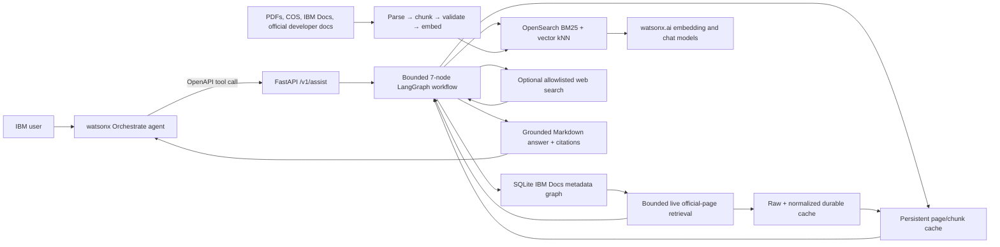

# Enterprise IT Support Copilot — Complete Project Handbook

**Repository:** `IT-help-desk`

**Audit date:** 16 July 2026

**Audience:** A new developer, manager, tester, operator, or IBM stakeholder with no prior project knowledge

---

## 1. Purpose of this document

This is the start-to-finish explanation of the Enterprise IT Support Copilot.
It explains the business problem, the architecture, every important technology,
how documents enter the system, how a user question becomes an answer, how live
IBM documentation retrieval works, where data is stored, how to run and test the
system, and what is still incomplete.

The repository audit covered 206 project files, excluding `.git/`, `.venv/`,
Python bytecode, pytest cache, and operating-system cache files. Source code,
configuration, prompts, scripts, tests, Markdown/HTML reports, JSON evaluation
records, PDFs, the Word report, and generated diagrams were inspected. Binary
source documents were inspected as documents rather than treated as text files.
Real secrets in `.env` are deliberately not reproduced here.

When files disagree, use this order of trust:

1. Current implementation under `app/`.
2. Current schemas and settings under `app/api/` and `app/core/`.
3. Current configuration under `config/` and the active process environment.
4. Current tests and the newest timestamped evaluation result.
5. This handbook and `docs/ibm-crawler.md`.
6. Older README, sprint logs, prompts, and reports, which are historical context.

That order matters because several older reports describe the original OCP-only
v1 system. The current code also supports IBM Bob, watsonx Orchestrate, a generic
IBM product domain, a global IBM Docs metadata graph, bounded live retrieval,
and optional official web search.

---

## 2. The project in one sentence

The project is an IBM technical-support chatbot that finds evidence in approved
documents and official IBM documentation, uses an LLM to turn that evidence
into a clear answer, cites every claim, and refuses to guess when the evidence
is not strong enough.

## 3. The problem it solves

IBM products have a large amount of documentation spread across PDFs, IBM Docs,
developer documentation sites, support pages, product versions, and internal
enablement material. An employee may know what they want to do but not know:

- which product page contains the answer;
- which version of the instructions applies;
- which exact commands must be run;
- whether a result is for Windows, Linux, OpenShift, or another platform;
- whether an answer came from an official source;
- or whether the assistant invented part of the answer.

The copilot provides one conversational entry point. A user can ask questions
such as:

- “What DNS records are required for SNO 4.16?”
- “How do I install the watsonx Orchestrate ADK CLI on Windows?”
- “How do I collect an Instana agent log?”
- “Which versions of watsonx Code Assistant for Z are documented?”
- “How do I configure Guardium Windows S-TAP?”

The system then finds the correct product, version, platform, pages, sections,
and commands before it asks the LLM to write the response.

## 4. What the product is—and is not

### It is

- A retrieval-augmented generation, or RAG, system.
- A citation-grounded technical support backend.
- A FastAPI service exposed to watsonx Orchestrate as OpenAPI tools.
- A hybrid-search system using keyword and semantic retrieval.
- A PDF and web-document ingestion pipeline.
- A metadata-first IBM Documentation discovery system.
- A bounded live documentation retriever with persistent caching.
- A controlled system that can clarify, refuse, or report weak evidence.

### It is not

- A general-purpose ChatGPT replacement with unrestricted knowledge.
- A recursive crawler that downloads the whole web during every question.
- A tool that logs in to a live cluster and changes it.
- A ticketing, ServiceNow, Jira, or incident-management integration.
- A guarantee that every IBM question can be answered.
- A system allowed to invent commands when documentation is missing.
- A per-user authorization system yet; the current API authenticates a shared
  API key, while finer classification/access-scope filters exist in the data
  model but are not derived from an authenticated user identity.

---

## 5. A simple mental model

Imagine a careful librarian working with an expert writer:

1. The **catalog** knows which books, versions, chapters, and links exist.
2. **OpenSearch** stores searchable passages from books already processed.
3. The **live retriever** opens a small number of official pages only when the
   answer is not already available.
4. **watsonx.ai embeddings** help find passages with similar meaning.
5. The **watsonx.ai chat model** writes an answer only from those passages.
6. The **citation validator** checks that every `[S1]`, `[S2]`, and so on points
   to a real passage that was actually retrieved.
7. If the librarian cannot find strong evidence, the system does not let the
   writer guess.

---

## 6. High-level architecture

The project has three connected planes:

- **Question plane:** Orchestrate, FastAPI, LangGraph, retrieval, answer generation.
- **Knowledge plane:** PDFs, websites, metadata graph, cache, embeddings, OpenSearch.
- **Runtime plane:** Podman, OpenSearch, local disk, watsonx.ai, ngrok, and deployment.



The architecture is deliberately bounded. The LLM does not decide arbitrary
actions and does not browse freely. Code controls the routes, limits, domains,
and stopping conditions.

---

## 7. Main technologies and why they are used

| Technology | Plain-language purpose | Where it appears |
|---|---|---|
| Python 3.11+ | Main programming language | Entire backend and scripts |
| FastAPI | Receives HTTP requests and publishes OpenAPI | `app/main.py`, `app/api/` |
| Uvicorn | Runs the FastAPI application as an HTTP server | Local and container startup |
| Pydantic | Validates configuration and request/response shapes | API schemas, registries, settings |
| pydantic-settings + python-dotenv | Loads typed environment and `.env` configuration | `app/core/config.py` |
| LangGraph | Runs the fixed seven-stage question workflow | `app/graph/` |
| LangChain Core | Supplies shared model/message interfaces used by the graph | Provider and graph integration |
| OpenSearch 2.15 | Stores documents/chunks and performs keyword/vector search | `app/retrieval/`, `scripts/create_index.py` |
| opensearch-py | Python client used to query and write OpenSearch | Retrieval and ingestion code |
| BM25 | Finds exact words such as command names and error text | Hybrid retriever |
| kNN vector search | Finds semantically similar passages | Hybrid retriever |
| Reciprocal Rank Fusion | Merges BM25 and vector result rankings | `app/retrieval/fusion.py` |
| watsonx.ai | Creates embeddings and generates grounded answers | `app/providers/` |
| IBM watsonx.ai Python SDK | Authenticates and calls watsonx models | `ibm-watsonx-ai` dependency |
| Granite embedding model | Converts text into 768-number semantic vectors | Configured model, current v2 indexes |
| IBM Cloud Object Storage | Durable source location for approved PDFs | `app/ingestion/cos_source.py` |
| IBM COS SDK | Python client for reading approved COS objects | `ibm-cos-sdk` dependency |
| SQLite + FTS5 | Stores and searches the lightweight IBM Docs graph | `MetadataCatalog` |
| httpx | Bounded HTTP fetching and optional search-provider calls | Crawler/retrieval code |
| Beautiful Soup | Extracts meaningful HTML structure | IBM and official-doc extractors |
| pdfminer.six | Extracts text page by page from PDFs | `app/ingestion/pdf_parser.py` |
| PyYAML | Loads manifests, domains, taxonomy, and registries | `config/` and ingestion |
| Podman | Runs local Linux OpenSearch without Docker Desktop | `scripts/podman_opensearch.sh` |
| ngrok | Gives Orchestrate an HTTPS route to the local FastAPI server | Local demo workflow |
| watsonx Orchestrate | User-facing agent and tool-calling interface | External UI/configuration |
| pytest | Unit and integration verification | `tests/` |
| pytest-asyncio | Runs asynchronous crawler/retrieval tests | Async test modules |
| structlog | Produces structured JSON-style operational logs | `app/observability/` |
| Ruff | Configured code-style/linting tool | `pyproject.toml` |
| Git | Tracks source changes and historical work | `.git/`, `.gitignore` |
| curl | Manual health/API/OpenSearch checks | Operations commands |
| Dockerfile | Builds a portable production container image | Code Engine/container deployment |
| IBM Code Engine | Documented future/shared hosting target | `deployment/CODE_ENGINE_DEPLOY.md` |

The local development choice and the deployment choice are different. Podman
replaces Docker Desktop on the managed Mac. The `Dockerfile` remains because
standard container build systems and Code Engine can still build that image.

---

## 8. User-facing layer: watsonx Orchestrate

watsonx Orchestrate is the chat interface and tool caller. It does not contain
the project’s indexed corpus itself. The backend is connected as an OpenAPI
custom tool.

The intended Orchestrate agent has two tools:

1. **Submit a technical support question** — calls `POST /v1/assist`.
2. **List indexed knowledge domains** — calls `GET /v1/domains`.

The first tool is used for technical questions. The second is only for questions
such as “Which domains are available?” It should not be called before every
question because the backend can infer the product.

### Orchestrate’s responsibility

- Pass the user’s wording to the backend without changing the technical meaning.
- Supply `requested_scope` only when the product or version is genuinely known.
- Respect the backend `status` field.
- Display `answer_markdown` exactly when the backend returns `ANSWERED`.
- Ask `clarification_question` when the backend returns `NEEDS_CLARIFICATION`.
- Never create its own answer after the backend reports insufficient evidence.

### Backend input shape

```json
{
  "question": "How do I install the watsonx Orchestrate ADK CLI on Windows?",
  "requested_scope": {
    "domain_id": "watsonx_orchestrate",
    "product": "watsonx Orchestrate",
    "product_version": "current"
  }
}
```

Only `question` is required. `requested_scope`, `conversation_id`, and up to four
conversation-context messages are optional.

### Voice and images

- Orchestrate can use a configured Speech to Text service. Voice is converted
  to text before this backend sees the request, so the normal text pipeline is
  unchanged.
- The current backend request schema has no image or file field. Image analysis
  is therefore not implemented here. An image would need to be processed in a
  separate backend/tool and converted into trusted text or structured evidence.
- Orchestrate’s “Chat with documents” feature is separate from this project’s
  external OpenAPI retrieval service and is not required for the current flow.

---

## 9. API layer

The API begins in `app/main.py`. It creates a FastAPI application, includes the
v1 routes, publishes interactive documentation at `/docs`, and generates a live
OpenAPI document at `/openapi.json`.

### Endpoints

| Endpoint | Authentication | Purpose |
|---|---|---|
| `GET /healthz` | None | Confirms the FastAPI process is alive |
| `GET /readyz` | None | Checks OpenSearch reachability and watsonx embedding-client initialization |
| `POST /v1/assist` | `X-API-Key` | Runs the complete support workflow |
| `GET /v1/domains` | `X-API-Key` | Returns indexed domains and current chunk counts |
| `GET /openapi.json` | None | Current machine-generated API contract |
| `GET /docs` | None | Swagger UI for manual testing |

### Authentication

`app/api/dependencies.py` reads the `X-API-Key` header and compares it with
`API_KEY_SECRET` using a constant-time comparison. Missing server configuration
returns HTTP 500. A missing or wrong client key returns HTTP 401.

The API key proves that a caller knows the shared secret. It is not currently
an individual IBM-user identity or role system.

### Request validation

Pydantic rejects malformed input before the graph runs:

- Question length: 3 to 2,000 characters.
- Conversation context: at most four messages.
- Total context text: at most 4,000 characters.
- Roles: only `user` or `assistant`.
- Domain IDs: only the four registered domain values.
- Deployment type: only `SNO`, `standard`, or `compact`.

### Response statuses

| Status | Meaning | Expected payload |
|---|---|---|
| `ANSWERED` | Evidence and citations passed all gates | `answer_markdown` and citations |
| `NEEDS_CLARIFICATION` | Product/version/scope is ambiguous | `clarification_question` |
| `INSUFFICIENT_EVIDENCE` | Product may be valid, but evidence is weak or missing | No answer |
| `OUT_OF_SCOPE` | Request is outside enabled product/support behavior | No answer |
| `INVALID_REQUEST` | Input is empty, too short, or too long | No answer |
| `ERROR` | Unexpected workflow/service failure | No answer; inspect logs |

These statuses are business outcomes inside an HTTP 200 response. HTTP 401 and
422 still represent authentication and schema failures.

---

## 10. The seven-node question workflow

`app/services/assist_service.py` creates request and trace IDs, converts explicit
scope into a dictionary, creates the initial `SupportState`, and invokes the
compiled LangGraph workflow.

### Node 1 — Input guard

File: `app/graph/nodes/input_guard.py`

- Trims and normalizes whitespace.
- Rejects text outside the 3–2,000 character boundary.
- Removes blank conversation messages.
- Ensures a request ID exists.
- Does not retrieve or generate anything.

### Node 2 — Classify and extract

File: `app/graph/nodes/classify_extract.py`

The watsonx chat model receives the classification prompt and returns JSON:

- intent: question, troubleshooting, summary, or unsupported;
- domain;
- OCP version and deployment type;
- component;
- IBM product and product version;
- whether a clarification is required.

Explicit API scope wins over model inference. If classification fails or returns
invalid JSON, safe defaults are used instead of crashing the request.

### Node 3 — Resolve scope

File: `app/graph/nodes/resolve_scope.py`

This is the main routing brain. It:

- applies deterministic exclusions before broad catalog matching;
- recognizes dedicated OpenShift, Orchestrate, and Bob domains;
- matches configured IBM product aliases and versions;
- falls back to the global IBM Docs catalog for other IBM products;
- preserves two OCP versions in comparison questions;
- refuses to silently replace a version named by the user;
- asks a focused clarification for broad or unavailable-version requests;
- creates strict OpenSearch product/version/domain filters;
- expands known user wording into documentation vocabulary when useful.

For generic IBM products, the canonical registry/catalog product name—not free
LLM text—becomes the strict retrieval filter. This prevents Guardium evidence
from being mixed with Instana, for example.

### Node 4 — Retrieve

File: `app/graph/nodes/retrieve.py`

When adaptive retrieval is disabled, the node performs indexed hybrid retrieval.
When enabled, it invokes `AdaptiveRetrievalRouter`, described in Section 12.

If indexed retrieval returns zero results, only inferred component/deployment/
OCP-version filters may be relaxed. Domain, product, product version, current
revision, classification, and access scope can never be relaxed.

### Node 5 — Evidence gate

File: `app/graph/nodes/evidence_gate.py`

The gate checks:

- that candidates exist;
- that an explicit OCP version matches;
- that explicit platform terms such as Windows or Linux are represented;
- that the text covers the requested topic and intent;
- that command questions contain command-like evidence;
- that version comparisons contain evidence for both versions.

If the evidence fails, generation stops with `INSUFFICIENT_EVIDENCE`. The LLM is
not asked to fill the gap from memory.

### Node 6 — Compose answer

File: `app/graph/nodes/compose_answer.py`

The node labels the selected chunks `[S1]`, `[S2]`, and so on, includes minimal
metadata, and calls the watsonx chat model with the grounded-answer prompt.

The prompt requires the model to:

- use only supplied evidence;
- cite every factual statement;
- preserve commands, flags, paths, casing, and placeholders;
- separate commands from output and configuration content;
- avoid mixing versions;
- use numbered diagnostics for troubleshooting;
- declare what the evidence does not establish;
- ignore instructions embedded inside retrieved documents;
- clearly separate live official web findings.

### Node 7 — Validate citations

File: `app/graph/nodes/validate_citations.py`

The final node rejects an answer when:

- it contains no `[S#]` label;
- it cites a source number outside the retrieved list;
- its main answer says the evidence does not contain or establish the requested
  procedure, command, version, or topic.

Only valid in-range citations produce `ANSWERED`. The citations returned to the
client include title, product, version, pages or section, document ID, chunk ID,
and official source URI when available.

---

## 11. Indexed retrieval: BM25, vectors, and RRF

`app/retrieval/hybrid_retriever.py` performs two searches against the current
OpenSearch chunks index.

### BM25 keyword search

BM25 is strong when wording must match exactly. It is useful for:

- `oc adm must-gather`;
- error strings;
- file paths;
- command names;
- exact product terminology.

### Vector kNN search

The user question is converted into a vector using the configured watsonx.ai
embedding model. kNN finds text with similar meaning even when the exact words
are different.

### Reciprocal Rank Fusion

RRF combines both ranked lists without requiring their raw scores to use the
same scale. A chunk found by both methods receives contributions from both and
usually rises in the final order.

The default retrieval values are:

- 20 BM25 results;
- 20 vector results;
- 12 fused candidates;
- 6 evidence chunks passed to generation;
- RRF constant 60.

The optional watsonx reranker provider exists, but the actual rerank call is not
implemented. `ENABLE_RERANKER` must remain false unless that provider is finished.

---

## 12. Adaptive retrieval: cache → index → graph → live → web

The adaptive router exists because pre-downloading and embedding millions of
IBM Docs pages is slow, expensive, and hard to refresh.

The controlled fallback order is:

1. Resolve one product/version documentation target.
2. Search normalized persistent cache for that target.
3. Search the current OpenSearch corpus.
4. Add metadata-only evidence when metadata can answer the question, such as a
   documented-version listing.
5. Test whether the combined evidence covers the actual intent.
6. Select candidate pages from the metadata catalog.
7. Fetch a small bounded set from IBM Docs or a registered official source.
8. Extract and rank relevant sections.
9. Optionally schedule background indexing into explicitly named staging indexes.
10. If still weak and separately enabled, call an allowlisted official web-search provider.
11. Return the best available candidates to the evidence gate.

Each stage and candidate count is recorded in the internal trace.

### Confidence is about intent, not just similarity

The router does not accept a result merely because BM25 or vector search liked
it. Examples:

- An install question must have install/prerequisite/getting-started evidence.
- A request for every command must have command-shaped content.
- A certificate-rotation question must mention rotate, rotation, renew, or refresh.
- A use-case question must contain use-case evidence.
- A Windows question cannot be satisfied by Linux-only text.
- A comparison between 4.14 and 4.16 must cover both versions.

---

## 13. The IBM Documentation knowledge graph

The “knowledge graph” is implemented as a durable SQLite database with normal
tables, graph-edge tables, and FTS5 full-text indexes. It is not an LLM memory
and it is not the OpenSearch vector index.

### What it stores

- IBM Docs root.
- Product nodes.
- Product version or hardware-model nodes.
- Sitemap nodes.
- Canonical topic URL nodes.
- Product name and family.
- Version and content key.
- Canonical URL and route type.
- Title, description, breadcrumbs, topic slug, and parent.
- Last-modified value and sitemap source.
- Content hash after a page is fetched.

### Edge types

- `contains_product`: root or product family contains a product.
- `has_version`: product has a version/model.
- `has_sitemap`: version is represented by a sitemap.
- `lists_topic`: sitemap lists a canonical topic.
- `parent` and `child`: exact navigation relationships.
- `related`: related documentation link.
- `outgoing_ibm`: another IBM link.
- `external`: non-IBM link retained as metadata, not trusted for retrieval.

### Metadata-only global build

`catalog-global` starts at `https://www.ibm.com/docs/en/sitemap.xml`, expands
the public child sitemap hierarchy, and stores links. It does not download topic
page bodies, create chunks, generate embeddings, or write OpenSearch data.

The first completed build recorded:

- 1,190 normalized products;
- 3,813 product/version/model targets;
- 7,170,623 canonical topic URL records;
- 7,178,708 graph nodes;
- 7,179,914 graph edges.

The host SQLite file was approximately 11 GB during this audit. It lives under
`IBM_DOCS_DATA_DIR`, outside the repository and outside the Podman VM.

### Why the graph is useful

For “install watsonx Orchestrate,” the product and install terms are used to:

1. Resolve the Orchestrate product/version.
2. Search only that target’s topic metadata.
3. Prefer titles/slugs/breadcrumbs that match installation.
4. Obtain the exact official URL.
5. Give that URL to the bounded live retriever.

The graph tells the system **where to look**. The fetched page text tells the
system **what the answer is**.

---

## 14. Bounded live documentation retrieval

`app/retrieval/live_docs.py` is the query-time page fetcher.

Default limits:

- 3 initial pages;
- 5 pages maximum, enforced in code;
- 1 related-link hop maximum;
- 3 concurrent workers;
- 30-second request timeout;
- 1.5-second politeness delay;
- 4 retries;
- 20 MB maximum response;
- 250 chunks maximum per fetched document;
- 24-hour cache freshness.

### Cold query

1. Select the strongest catalog pages.
2. Check whether fresh normalized artifacts already exist.
3. Fetch missing/stale pages with conditional headers.
4. Validate redirects, content type, response size, robots policy, and path scope.
5. Save raw HTML or Markdown.
6. Extract title, headings, lists, code, tables, breadcrumbs, and links.
7. Chunk the structured result.
8. Rank only the most relevant sections.
9. Return evidence for the current answer.
10. Save artifacts for reuse.

### Warm query

The same page can be answered from cached normalized content with zero network
requests. A stale cache sends ETag/Last-Modified headers. HTTP 304 reuses the
existing artifacts.

### Related links

Related links are not recursively crawled. At most one hop is considered, and
only while the five-page total has not been reached. A cross-product IBM Docs
link is allowed only when the global catalog can map it to a known target.

---

## 15. Official developer-documentation sources

Not all official IBM documentation is under `www.ibm.com/docs`. The project has
a separate exact-host adapter registry in `config/official_doc_sources.yaml`.

Current adapters include:

- watsonx Orchestrate ADK documentation from
  `developer.watson-orchestrate.ibm.com/llms.txt`;
- IBM Bob documentation from `bob.ibm.com/docs` and its sitemap;
- Verify Access developer documentation from `docs.verify.ibm.com/llms.txt`.

These adapters reuse the same catalog/cache/chunk/rank pipeline while enforcing
their own HTTPS host, path, robots, content-format, and redirect boundaries.

Markdown code fences, HTML `<pre><code>`, ordered lists, tables, inline code,
and heading paths are deliberately preserved because command quality depends on
structure, not just words.

---

## 16. Optional live internet search

The last fallback is modular and off by default. It supports:

1. An approved enterprise HTTPS JSON search gateway.
2. The OpenAI Responses API hosted `web_search` tool.

It does not scrape a search-results HTML page. Results must use HTTPS and match
the configured official-domain allowlist. Default priorities are IBM Docs, IBM
Support, IBM Cloud, IBM product sites, and IBM Redbooks.

Live web candidates are marked `official_live_web`. The answer receives a
visible “Live web fallback” notice and a different safety note. Claims from this
source must appear under a separate official-live-web heading.

Enabling this feature without a valid endpoint/API key fails closed. It does not
silently fall back to the LLM’s training knowledge.

---

## 17. Offline ingestion: how knowledge enters OpenSearch

The original PDF/web ingestion path remains intact. It is used for approved,
prebuilt corpora that should be fast and fully searchable without a live fetch.

```text
Corpus manifest
  → source discovery
  → COS/local/web download
  → PDF or text/HTML parse
  → token-aware structured chunking
  → metadata validation
  → watsonx.ai embeddings
  → OpenSearch chunks + document registry
  → audit and evaluation
```

### Step 1 — Manifest

YAML files under `config/corpus/` list sources and approved metadata: URI, title,
domain, product, version, deployment types, components, document type,
classification, access scopes, and topic tags.

### Step 2 — Source access

`cos_source.py` supports:

- `cos://...` for IBM Cloud Object Storage;
- `local://...` for local source documents;
- `https://...` for web documents.

If COS configuration is unavailable, a COS URI attempts a same-filename local
fallback. This is convenient for development but operators must verify that the
local file is the intended source.

### Step 3 — Web expansion

The legacy manifest path supports:

- `web_index`: reads a Markdown/`llms.txt` index and expands approved links;
- `web_crawl`: breadth-first crawls allowed prefixes up to a page limit.

For IBM Docs and current official sources, prefer the newer hardened crawler
packages because they add robots, redirect, path, size, and cache controls.

### Step 4 — Parsing

- PDF parsing uses pdfminer and preserves real page numbers.
- HTML/Markdown/plain-text parsing creates section-like pseudo-pages.
- Structured IBM/official extractors preserve headings, commands, lists, tables,
  breadcrumbs, and links.

### Step 5 — Token-aware chunking

Current chunker: `chunker-v6`.

Targets:

- 150-token preferred minimum;
- 400-token maximum estimate;
- 40-token overlap;
- 1,600-character secondary ceiling.

Technical text has unpredictable token density. A URL, hash, path, JSON object,
or command can use far more tokens per character than normal prose. Chunker v6
therefore counts alphanumeric subword-like pieces and punctuation instead of
assuming a fixed characters-per-token ratio.

It also:

- prefers paragraph, line, and sentence boundaries;
- preserves section paths;
- tracks correct PDF page ranges;
- avoids duplicate trailing overlap chunks;
- flushes structured web sections separately;
- and always moves the sliding window forward.

The embedding provider is still the final authority. If it rejects one chunk as
too long, the indexer recursively splits that chunk and retries it. Transient
provider errors are not incorrectly treated as length problems.

### Step 6 — Metadata validation

`metadata.py` checks every document against the controlled taxonomy. Invalid
domains, products, OCP versions, deployment types, classifications, access
scopes, document types, or components are rejected before indexing.

Generic `ibm_products` entries can use canonical free-form product/component
names. A product version is optional at this common validation layer, while
classification is required and access scope is controlled whenever supplied.
The product registries and live-retrieval target resolution apply their own
stricter version requirements where a version-specific source is needed.

### Step 7 — Embedding

The current confirmed embedding model is:

`ibm/granite-embedding-278m-multilingual`

Its vector dimension is 768. The older Slate model must not be used. Changing
the embedding model or dimension requires a new/recreated index and complete
re-embedding; vectors from different models must never be mixed.

### Step 8 — Idempotent indexing and revisions

Stable IDs are based on source URI and content hash:

- `document_id` identifies the source URL/URI.
- `revision_id` identifies one content revision.
- `chunk_id` combines domain, document, revision, and ordinal.

Re-ingesting unchanged content is skipped unless forced. Changed content creates
a new revision and marks old chunks `is_current=false`. Partial embedding writes
are recorded as `PARTIAL`; zero successfully indexed chunks are `FAILED`.

---

## 18. OpenSearch data model

The system uses two logical indexes.

### Chunks index

Default current name: `knowledge_chunks_v2`.

Each record contains:

- identity: chunk, document, revision;
- domain/product/version metadata;
- classification and access scope;
- OCP version/deployment/component fields;
- title, source type, source URI;
- section and page location;
- chunk text;
- 768-dimensional vector;
- parser/chunker/embedding provenance;
- ingestion timestamp and `is_current`.

`chunk_text` uses the English analyzer for BM25. `chunk_text_vector` uses HNSW,
cosine similarity, and the Lucene engine for kNN.

### Documents index

Default current name: `knowledge_documents_v2`.

This is the registry of source revisions and ingestion outcomes. It stores the
content hash, metadata bag, status, chunk count, failed-page count, errors, and
ingestion time.

### Staging indexes

Live/batch IBM Docs writes are deliberately directed to explicit staging names,
for example:

- `knowledge_chunks_ibm_docs_staging_v2`;
- `knowledge_documents_ibm_docs_staging_v2`.

The crawler refuses production-like index names for staging promotion. A human
must audit and promote the result separately.

### Last recorded corpus state

The current crawler documentation records 14,609 searchable v2 chunks and 316
document records after validation. The v1 indexes remain available as a rollback
target. Runtime counts should always be checked from the active OpenSearch
instance because they change after ingestion.

---

## 19. Local OpenSearch with Podman

Docker Desktop is not required. The helper script manages:

- rootless Podman machine `it-helpdesk`;
- 4 CPUs;
- 8 GiB RAM;
- 50 GiB VM disk;
- OpenSearch container `it-helpdesk-opensearch`;
- pinned OpenSearch 2.15.0;
- Java heap of 2 GiB;
- loopback-only port `127.0.0.1:9200`.

Host storage:

```text
~/.local/share/it-helpdesk/opensearch/
├── data/
├── snapshots/
└── logs/
```

These directories are mounted into the container. Therefore data survives a
container restart, container deletion/recreation, and Podman machine stop/start.
It does not survive deletion of the host directory or macOS user account.

The local security plugin is disabled only because the service is bound to
loopback. A remote/shared deployment must use HTTPS, credentials, trusted CA
verification, and private network access.

Important commands:

```bash
scripts/podman_opensearch.sh init
scripts/podman_opensearch.sh start
scripts/podman_opensearch.sh status
scripts/podman_opensearch.sh verify
scripts/podman_opensearch.sh snapshot
scripts/podman_opensearch.sh stop
```

OpenSearch host data and crawler host data are separate. A snapshot of OpenSearch
does not automatically back up the 11 GB metadata catalog/cache directory.

---

## 20. Persistent crawler/cache storage

Default location:

`~/.local/share/it-helpdesk/ibm-docs-crawler`

Layout:

```text
ibm-docs-crawler/
├── state/crawl.sqlite3
├── raw/<run-id>/<prefix>/<document-id>.(html|md)
├── normalized/documents/<run-id>/<document-id>.json
├── normalized/chunks/<run-id>/<document-id>.jsonl
└── runs/<run-id>.json
```

The SQLite database stores catalog pages, targets, nodes, edges, run pages,
resource validators, and artifact locations. Raw and normalized files are the
reusable body cache. A Podman reset should not touch this directory, but it still
needs an approved backup such as COS.

---

## 21. Configuration and feature flags

Settings are loaded from process environment variables and `.env`. `.env` must
never be committed or copied into reports.

### Secret settings

- `IBM_CLOUD_API_KEY`
- `WATSONX_PROJECT_ID`
- `COS_API_KEY`
- `API_KEY_SECRET`
- optional `LIVE_WEB_SEARCH_API_KEY`

### Core non-secret settings

- OpenSearch URL, credentials, index names, certificate verification, vector dimension.
- watsonx URL and model IDs.
- COS endpoint and bucket.
- public API base URL.
- crawler user agent, data directory, timeouts, size limits, retries.
- retrieval result counts and RRF constant.
- logging level.

### Feature flags

| Flag | Effect |
|---|---|
| `ENABLE_ADAPTIVE_RETRIEVAL` | Turns on cache/catalog/live routing |
| `ENABLE_LIVE_IBM_DOCS` | Permits bounded IBM Docs page fetches |
| `ENABLE_LIVE_OFFICIAL_SOURCES` | Permits registered developer-doc sources |
| `ENABLE_LIVE_DOCS_INDEXING` | Schedules retrieved artifacts into explicit staging indexes |
| `ENABLE_LIVE_WEB_SEARCH` | Permits final official-domain search fallback |
| `ENABLE_RERANKER` | Calls reranker; currently must remain false |

All are false in code and `.env.example` by default. During this audit, the
workspace `.env` did not explicitly contain `ENABLE_*` keys. A newly started
process that relies only on that file will therefore use false unless the flags
are exported by its parent environment. Verify the actual launch environment
before claiming that live retrieval is enabled.

Never print `.env` in logs, screenshots, issues, or documentation.

---

## 22. Running the full system locally

### One-time setup

```bash
python3.11 -m venv .venv
source .venv/bin/activate
pip install -r requirements.txt
cp .env.example .env
```

Fill `.env` with approved credentials and model IDs. Do not commit it.

### Start OpenSearch

```bash
scripts/podman_opensearch.sh start
curl http://127.0.0.1:9200/_cluster/health?pretty
```

### Create indexes when needed

```bash
.venv/bin/python scripts/create_index.py
```

Do not use `--recreate` against an index containing data unless deletion is
intentional and a restore/re-ingestion path is confirmed.

### Start FastAPI

The evaluation tooling currently expects port 8001:

```bash
.venv/bin/uvicorn app.main:app --host 127.0.0.1 --port 8001
```

Verify:

```bash
curl http://127.0.0.1:8001/healthz
curl http://127.0.0.1:8001/readyz
```

### Start ngrok for Orchestrate

```bash
ngrok http --url=left-appraiser-disorder.ngrok-free.dev 8001
```

The reserved ngrok hostname and port must match the running service. Do not put
`/openapi.json` into the connector’s runtime server field. The server base URL
is the hostname; `/openapi.json` is used to import or refresh the tool schema.

### Call the API manually

```bash
curl -X POST http://127.0.0.1:8001/v1/assist \
  -H "X-API-Key: $API_KEY_SECRET" \
  -H "Content-Type: application/json" \
  -d '{
    "question": "What DNS records are required before SNO 4.16 installation?",
    "requested_scope": {
      "domain_id": "ocp_sno_support",
      "ocp_version": "4.16",
      "deployment_type": "SNO"
    }
  }'
```

---

## 23. Building and refreshing the metadata graph

Set a descriptive contact-bearing user agent before crawler network operations:

```bash
export IBM_DOCS_USER_AGENT='IBM-IT-Helpdesk-DocsCrawler/1.0 monitored-contact@example.com'
export IBM_DOCS_DATA_DIR="$HOME/.local/share/it-helpdesk/ibm-docs-crawler"
```

The contact is operational identification for polite HTTP traffic. It is not
used to log in to IBM Docs.

### Global metadata-only build

```bash
.venv/bin/python scripts/crawl_ibm_docs.py catalog-global --concurrency 6
```

### Resume/finalize structure

```bash
.venv/bin/python scripts/crawl_ibm_docs.py catalog-finalize
```

### Inspect counts

```bash
.venv/bin/python scripts/crawl_ibm_docs.py catalog-stats
```

### Catalog one registered product

```bash
.venv/bin/python scripts/crawl_ibm_docs.py catalog \
  --product cloud-pak-data --version latest
```

### Catalog a registered official source

```bash
.venv/bin/python scripts/crawl_ibm_docs.py source-plan --source orchestrate-adk
.venv/bin/python scripts/crawl_ibm_docs.py source-catalog --source orchestrate-adk
```

### Directly test bounded retrieval

```bash
.venv/bin/python scripts/crawl_ibm_docs.py source-retrieve \
  --source orchestrate-adk \
  --query 'How do I install the watsonx Orchestrate ADK CLI on Windows?' \
  --max-pages 1 --no-related --summary
```

Repeat it. A warm run should report cache hits and no network fetch.

---

## 24. Batch crawler and staging workflow

The batch path is for audits, prewarming, backfills, or deliberately indexing a
larger reviewed corpus.

1. `plan` validates the target without network access.
2. `crawl` fetches and stages artifacts but does not index.
3. `audit` inspects a run ID.
4. `index-staging` embeds only a clean staged run into explicit staging indexes.
5. An operator verifies quality, snapshot, rollback, and promotion separately.

Ten-product portfolio example:

```bash
.venv/bin/python scripts/crawl_ibm_docs_portfolio.py \
  --max-pages-per-product 10 \
  --index \
  --chunks-index knowledge_chunks_ibm_docs_staging_v2 \
  --docs-index knowledge_documents_ibm_docs_staging_v2
```

The script’s default portfolio includes MQ, API Connect, Db2, WebSphere,
Storage Scale, Cloud Pak for Data, Storage Protect, Verify Access, App Connect,
and DataPower. The registry additionally includes Orchestrate, Guardium,
Instana, and Cloud Pak for Integration.

---

## 25. Testing and quality evidence

### Current code test result

Command:

```bash
.venv/bin/python -m pytest -q -rs
```

Audit result on 16 July 2026:

- **211 passed**;
- **11 skipped**;
- **0 failed**.

The skipped tests require a reachable OpenSearch service and, for vector tests,
working watsonx.ai credentials. They were skipped because those dependencies
were not reachable in the test process, not because their assertions failed.

### What unit tests cover

- API schema boundaries and scope mapping.
- Graph status routes and citation enforcement.
- Strict and relaxable OpenSearch filters.
- RRF merging.
- Token-aware chunking and page attribution.
- Embedding-length split/retry.
- Metadata validation.
- IBM Docs URL, robots, redirect, response-size, sitemap, extraction, storage,
  promotion, and staging controls.
- Catalog search and graph enrichment.
- Cold fetch and warm cache reuse.
- Official-source Markdown/HTML command preservation.
- Cross-source isolation.
- OS/platform constraints.
- Official web-search domain filtering and fail-closed configuration.

### Current evaluation records

- Latest 40-question gold evaluation: **40/40 passed**.
- Eight-product acceptance evaluation: **8/8 passed**.
- Guardium regression: **2/2 passed**.
- Cloud Pak for Data live certificate-rotation probe: **1/1 passed**.
- v2 chunk audit: 313 documents sampled, all passed in the recorded audit.

Evaluation is not proof of every possible question. It proves the named cases,
statuses, product isolation, required concepts, and citations.

---

## 26. Security and safety controls

### API and secret controls

- API key is checked with constant-time comparison.
- Secrets come from environment variables.
- `.env` is ignored by Git.
- Logs omit full questions, chunk content, and secrets.
- Request and trace IDs support debugging without logging the whole payload.

### Retrieval controls

- Domain/product/version filters are strict.
- Current revisions only.
- Explicit OS/platform constraints are enforced.
- Classification/access-scope fields cannot be relaxed.
- Dedicated domains cannot fall through to an unrelated global product.
- Evidence and citations are mandatory.

### Network controls

- HTTPS official-source allowlists.
- Exact host and path boundaries.
- No credentials/custom ports in crawl URLs.
- Public-DNS validation to reduce SSRF risk.
- Redirect validation at every step.
- Fail-closed robots policy.
- Response-size, retry, page, chunk, concurrency, delay, and depth limits.
- No `/docs/api` bypass.
- No JavaScript/browser evasion of unusable pages.
- No unapproved third-party domains by default.

### Answer controls

- Retrieved documents are reference material, not instructions to the model.
- Prompt-injection text inside a page must be ignored.
- Missing evidence is not treated as proof of unsupported behavior.
- Version fragments are not combined into one procedure.
- Live web evidence is visibly labeled.

---

## 27. Observability and troubleshooting

Logs are structured JSON. A completed request records status, intent, candidate
count, evidence/citation count, request ID, trace ID, and total duration.

### API returns HTTP 401

- Confirm the `X-API-Key` header exists.
- Confirm it matches `API_KEY_SECRET` in the server process.
- Reconfigure the Orchestrate connector credential if necessary.

### API returns HTTP 422

- Inspect the Pydantic validation message.
- Check question length and requested-scope field names/values.
- Refresh the Orchestrate tool if it still shows an older schema.

### `/readyz` is degraded

- Start Podman/OpenSearch.
- Confirm `OPENSEARCH_URL` and port.
- Check the configured watsonx project, API key, and embedding model.
- Note that the current watsonx readiness check initializes the client; it does
  not embed a test string.

### `OUT_OF_SCOPE` for a real IBM product

- Confirm the global metadata catalog exists and the product resolves.
- Confirm adaptive retrieval is actually enabled in the running process.
- Check aliases and canonical product/version names.
- Check whether the deterministic exclusion policy matched the wording.

### `INSUFFICIENT_EVIDENCE`

- Inspect the internal retrieval trace and selected stage.
- Check platform/version constraints.
- Search the catalog for a better page title/topic.
- Verify live flags and user agent.
- Inspect cached/raw/normalized artifacts.
- Add a registered official source when IBM Docs is not the right source.
- Do not solve it by telling Orchestrate to invent an LLM answer.

### OpenSearch data appears missing

- Check the active v1/v2 index names.
- Check the host-mounted data directory.
- List indexes and document counts.
- Check snapshots.
- Re-ingest from COS/local source artifacts if necessary.
- Remember that removing Docker Desktop cannot be repaired by Podman; only data
  stored outside Docker’s old VM/container is recoverable.

---

## 28. Deployment paths

### Local demonstration

`Orchestrate → ngrok HTTPS → local FastAPI:8001 → local Podman OpenSearch + watsonx.ai`

This is easy to demonstrate but depends on the laptop, tunnel, network, and
local processes remaining available.

### Shared/production direction

The repository contains a Dockerfile and a Code Engine deployment guide. A
shared deployment should use:

- managed build/deployment rather than a laptop tunnel;
- HTTPS and private authenticated OpenSearch;
- secret manager/service bindings;
- persistent approved object/storage backups;
- explicit live-retrieval rollout flags;
- per-user identity and access-scope enforcement;
- monitoring, rate limiting, quotas, and alerts;
- a stable production OpenAPI server URL.

The existing Code Engine guide is an earlier deployment guide and must be
rechecked against current v2 settings, adaptive retrieval, 11 GB catalog storage,
and current security requirements before production use.

---

## 29. Current limitations and technical debt

1. **Static OpenAPI drift.** The live FastAPI `/openapi.json` is the best schema.
   `openapi/it_helpdesk_live.json` is an older OCP-only generated snapshot.
   `openapi/it_helpdesk_v1.yaml` has a friendly Orchestrate operation ID but some
   older description/port wording. Regenerate and keep one canonical artifact.
2. **Feature-flag drift.** Code and `.env.example` default live features off;
   confirm active process flags rather than relying on old session claims.
3. **Reranker unfinished.** Provider wrapper exists but raises
   `NotImplementedError` when enabled.
4. **No image endpoint.** The API accepts text only.
5. **Conversation state is limited.** `conversation_id` is accepted but not used
   by `assist_service`; conversation context is carried in graph state but the
   current prompts primarily use the current question and evidence.
6. **Shared API-key auth only.** Per-user classification/access scopes are not
   resolved from identity yet.
7. **Full metadata catalog is large.** The local SQLite database is about 11 GB
   and must be backed up and provisioned appropriately in shared hosting.
8. **Live web search is configuration-dependent.** It is code-complete but must
   stay off without an approved provider and credential.
9. **Coverage is evidence-dependent.** A metadata URL does not guarantee that a
   selected live page contains every answer or command.
10. **Generated/historical files can mislead.** Several reports contain older
    7/40, 38/40, v1, Slate, Docker, or OCP-only status statements.
11. **Misnamed backup PDFs.** Files under
    `docs/local_backup_before_cos_pull_*` are HTML pages saved with `.pdf`
    extensions, not usable PDFs. Do not ingest them.
12. **Dirty working tree.** The audited workspace contains many modified and
    untracked project files. Preserve them and create a reviewed commit/backup
    before risky refactors.

---

## 30. Source-document inventory

### Real OCP/SNO PDFs under `docs/`

- SNO Agent-based Installer 4.14 and 4.16.
- OCP 4.16 networking.
- OCP 4.16 storage.
- OCP 4.16 support/troubleshooting.
- OCP 4.16 authentication and authorization.
- OCP 4.16 operators.
- OCP 4.16 updating clusters.

These are text-extractable Red Hat documentation. The 4.16 networking PDF is
the largest at more than 1,000 pages. The SNO 4.16 source is 104 pages.

### watsonx Orchestrate enablement material

- Client Level 2 presentation.
- Seller Level 2 presentation.
- Level 2 master notes.
- Level 3 demo guide.
- Stand-and-deliver Markdown script.

Their manifests distinguish public, internal, seller-enablement, demo, and
study-note access scopes. Dated material must not be treated as current product
availability without verification.

### Reports and diagrams

- Weekly Word/PDF progress reports.
- Architecture PNG.
- Rendered Word-report preview.
- `CHUNK_AUDIT_V2.md` with the recorded per-document audit.

These explain or validate the project; they are not automatically part of the
retrieval corpus unless listed in a corpus manifest.

---

## 31. Repository map and file-by-file responsibility

### Root files

| File | Responsibility |
|---|---|
| `.env` | Local secrets/runtime values; never commit or expose |
| `.env.example` | Safe template and documented defaults |
| `.gitignore` | Excludes secrets, environments, caches, data, logs |
| `.vscode/extensions.json` | Recommends Markdown editing extension |
| `README.md` | Quick-start overview; some counts/architecture are historical |
| `EXPLAINER.md` | Earlier detailed intern guide and project history |
| `PROJECT_PIPELINE_REPORT.md` | Earlier implementation report; contains obsolete gap statements |
| `FINAL_INTERNSHIP_PROJECT_REPORT.md` | Earlier project report and interview explanation |
| `SESSION-LOG-V3.md` | Chronological sprint history, not current source of truth |
| `BOB-DAY11-MULTIDOMAIN-CONTEXT.md` | Day 11 Bob handoff and Orchestrate guidance |
| `BOB-Developer-B-work-done.md` | Developer B historical work log |
| `DEVELOPER-A-PROMPT.md` | Historical Bob development prompt for backend ownership |
| `DEVELOPER-B-PROMPT.md` | Historical Bob prompt for ingestion/evaluation ownership |
| `RESTART-GUIDE.md` | Historical destructive restart plan; do not run casually |
| `Dockerfile` | Python 3.11 non-root API container build |
| `requirements.txt` | Pinned Python dependencies |
| `pyproject.toml` | Package metadata and pytest/Ruff settings |
| `it_helpdesk_v1.yaml` | Additional older OpenAPI snapshot |
| `ibm-it-help-desk-copilot-independent-architecture-plan.html` | Rendered architecture review/plan |

### Application entry point

- `app/main.py`: creates FastAPI, attaches routes, and exposes health, readiness,
  Swagger, and OpenAPI endpoints.
- `app/__init__.py`: marks the top-level application package.

### `app/api/`

- `schemas.py`: locked request, response, citation, health, readiness, domain models.
- `dependencies.py`: API-key security.
- `routes.py`: `/v1/assist` and `/v1/domains`.
- `__init__.py`: package marker.

### `app/core/`

- `config.py`: all environment-backed settings and feature flags.
- `__init__.py`: package marker.

### `app/services/`

- `assist_service.py`: request IDs, graph invocation, response mapping, safety note.
- `domains_service.py`: OpenSearch aggregation for domain counts.
- `__init__.py`: package marker.

### `app/graph/`

- `state.py`: shared typed workflow state.
- `workflow.py`: node wiring and early exits.
- `nodes/input_guard.py`: input validation.
- `nodes/classify_extract.py`: LLM intent/scope extraction.
- `nodes/resolve_scope.py`: deterministic product/version/domain routing.
- `nodes/retrieve.py`: indexed or adaptive retrieval entry.
- `nodes/evidence_gate.py`: evidence sufficiency decision.
- `nodes/compose_answer.py`: evidence prompt and answer generation.
- `nodes/validate_citations.py`: final citation/refusal enforcement.
- package `__init__.py` files expose modules.

### `app/retrieval/`

- `opensearch_client.py`: cached OpenSearch client and ping.
- `filters.py`: strict metadata filters and controlled relaxation.
- `hybrid_retriever.py`: BM25 plus vector search.
- `fusion.py`: RRF implementation.
- `adaptive_router.py`: complete staged fallback router.
- `catalog_selector.py`: topic-page ranking inside one product/version.
- `constraints.py`: Windows/Linux/macOS/AIX/z/OS/OpenShift/Kubernetes facets.
- `section_ranker.py`: section/chunk relevance and confidence rules.
- `live_docs.py`: bounded IBM Docs fetch/cache/extract/chunk path.
- `official_docs.py`: official non-IBM-Docs source specialization.
- `live_index.py`: optional single-worker background staging indexing.
- `web_search.py`: enterprise JSON and OpenAI search adapters.
- `__init__.py`: package marker.

### `app/providers/`

- `watsonx_embeddings.py`: single/batch embedding and readiness initialization.
- `watsonx_chat.py`: deterministic-temperature chat generation.
- `watsonx_rerank.py`: disabled/unfinished rerank interface.
- `__init__.py`: package marker.

### `app/policy/`, `app/prompts/`, and `app/observability/`

- `domain_policy.py`: active domain registry and deterministic exclusions.
- `evidence_policy.py`: version, platform, topic, and intent evidence rules.
- `classify_extract.md`: routing prompt and JSON contract.
- `grounded_answer.md`: evidence-only answer contract.
- `logging.py`: JSON logging and safe request events.
- package `__init__.py` files mark packages.

### Core ingestion files

- `pdf_parser.py`: page-by-page PDF extraction.
- `text_parser.py`: Markdown/HTML/plain-text pseudo-page parsing.
- `chunker.py`: chunker-v6.
- `metadata.py`: taxonomy validation.
- `cos_source.py`: COS/local/web source abstraction.
- `web_source.py`: legacy `llms.txt` and bounded prefix crawl expansion.
- `indexer.py`: idempotent embedding and OpenSearch revisions.
- `run.py`: manifest CLI/orchestration and result counts.
- `__init__.py`: package marker.

### `app/ingestion/ibm_docs_crawler/`

- `catalog.py`: SQLite schema, FTS search, graph nodes/edges, product resolution.
- `catalog_discovery.py`: one-target sitemap-only metadata build.
- `global_discovery.py`: entire public sitemap portfolio build.
- `config.py`: crawler limits from environment.
- `crawler.py`: fetch-to-durable-staging batch run.
- `extractor.py`: command/table/section/link-preserving HTML extraction.
- `fetcher.py`: polite bounded HTTP client and DNS/redirect controls.
- `models.py`: typed documents, blocks, fetches, sitemap entries, reports.
- `promotion.py`: clean audited run to explicit staging indexes.
- `registry.py`: validated operational product/version allowlist.
- `robots.py`: fail-closed robots policy.
- `sitemap.py`: bounded XML/gzip sitemap parsing.
- `storage.py`: run/resource SQLite state and immutable artifacts.
- `urls.py`: canonical URL and exact path enforcement.
- `__init__.py`: public package exports.

### `app/ingestion/official_docs/`

- `registry.py`: official-source Pydantic registry and target selection.
- `discovery.py`: `llms.txt`/sitemap metadata discovery.
- `extractor.py`: Markdown/MDX/HTML structured extraction.
- `fetcher.py`: exact-source robots-aware fetching.
- `urls.py`: host/path/format validation.
- `__init__.py`: package exports.

### Configuration files

- `config/domains.yaml`: four active retrieval domains.
- `config/taxonomy/ocp_sno.yaml`: controlled metadata vocabulary.
- `config/ibm_docs_registry.yaml`: Orchestrate plus 13 explicit IBM Docs products.
- `config/official_doc_sources.yaml`: Orchestrate ADK, Bob, Verify adapters.
- `config/corpus/ocp_sno_poc.yaml`: full OCP/SNO PDF corpus.
- `config/corpus/new_pdfs_only.yaml`: focused operators/update additions.
- `config/corpus/ocp_storage_v2_recovery.yaml`: storage reprocessing manifest.
- `config/corpus/watsonx_orchestrate.yaml`: developer docs and L2/L3 material.
- `config/corpus/ibm_bob.yaml`: bounded Bob IDE web corpus.

### OpenAPI and deployment files

- `openapi/it_helpdesk_live.json`: older generated OCP-only OpenAPI snapshot.
- `openapi/it_helpdesk_v1.yaml`: hand-maintained Orchestrate-oriented API schema.
- `it_helpdesk_v1.yaml`: another older root-level schema snapshot.
- `deployment/CODE_ENGINE_DEPLOY.md`: container/Code Engine deployment procedure
  that must be reconciled with the current v2/adaptive settings before production.

### Scripts

- `create_index.py`: creates chunk/document mappings.
- `podman_opensearch.sh`: local runtime, persistence test, snapshot.
- `crawl_ibm_docs.py`: plan, catalog, crawl, audit, source retrieve, staging index.
- `crawl_ibm_docs_portfolio.py`: multi-product batch pilot.
- `audit_chunks.py`: OpenSearch structural quality report.
- `validate_env.py`: required-setting and connection preflight.
- `smoke_test.py`: temporary-index BM25/vector/RRF smoke test.
- `run_eval.py`: 40-question API evaluation and Markdown report.
- `build_weekly_progress_report.py`: generates the Word/PDF progress report assets.

### Tests

- `tests/unit/`: 15 focused modules covering schemas, services, filters, RRF,
  graph, parser, chunker, indexer, metadata, crawler, adaptive retrieval, official
  sources, and audits.
- `tests/integration/test_opensearch.py`: live index/BM25/filter round trips.
- `tests/integration/test_vector_retrieval.py`: live embedding/vector/RRF checks.
- `tests/evaluation/run_evaluation.py`: strict status/product/keyword evaluator.
- `tests/evaluation/*.yaml`: gold, product, and Guardium question sets.
- `tests/evaluation/results/*.json`: timestamped historical runs; the newest
  relevant result should be used, not an earlier failure while bugs were being fixed.
- `tests/fixtures/*.json`: safe sample request/chunk records.
- `tests/conftest.py`: isolates tests from locally enabled live flags.

### Documentation and reports

- `docs/ibm-crawler.md`: most current crawler architecture and operating guide.
- `docs/ibm-docs-crawler-plan.md`: original blueprint.
- `docs/podman-opensearch.md`: complete local OpenSearch operations/recovery guide.
- `docs/operations/EVAL_RESULTS.md`: latest readable 40-question summary.
- `docs/watsonx_orchestrate_l2/`: source context, presentations, notes, demo script.
- `deployment/CODE_ENGINE_DEPLOY.md`: earlier shared container deployment guide.
- `reports/CHUNK_AUDIT_V2.md`: recorded v2 document audit.
- `reports/`: weekly report, PDF, architecture image, rendered preview.

### Generated and non-source files

- `__pycache__/`, `*.pyc`: Python bytecode; safe to regenerate.
- `.pytest_cache/`: pytest cache; safe to regenerate.
- `.DS_Store`: macOS folder metadata; not project logic.
- `.venv/`: local dependency environment; rebuild from requirements.
- `.git/`: version-control database; not application logic, but preserve it.
- Historical evaluation JSONs: immutable evidence of past runs, not runtime input.
- Misnamed local-backup `.pdf` files: HTML download/error content, not PDFs.

---

## 32. How to safely change the project

### Changing the API

Update schemas, routes, tests, generated OpenAPI, Orchestrate tool import, and
behavior prompt together. Treat request/response models as a shared contract.

### Adding a product

If it is already in the global graph, first verify free-form resolution and live
retrieval. Add a registry record only when an operational override is needed.
Use the canonical product name, aliases, exact version path, sitemap, seed URL,
classification, access scope, and conservative limits. Add product tests.

### Adding an official source outside IBM Docs

Add an exact entry to `official_doc_sources.yaml`, not a broad domain. Validate
host, path, robots, index format, content format, seed, and source-specific tests.

### Changing the embedding model

Create a new index generation, set the correct dimension, recreate mappings,
re-ingest every source, run retrieval/evaluation, snapshot, and switch aliases or
configuration only after validation.

### Changing chunking

Increment `CHUNKER_VERSION`, test dense code/table/path text, re-ingest into a
new/staging index, audit page/section/command preservation, and evaluate.

### Changing security filters

Never make `domain_id`, product, product version, `is_current`, classification,
or access scope relaxable. Add negative leakage tests.

---

## 33. What a new team member should do first

1. Read Sections 2–18 of this handbook.
2. Read `app/api/schemas.py` and `app/graph/workflow.py`.
3. Trace one question through every graph node.
4. Read `docs/ibm-crawler.md` and `adaptive_router.py`.
5. Review `.env.example` without opening or sharing real `.env` values.
6. Run the 211 unit-capable tests.
7. Start Podman/OpenSearch and rerun the 11 integration tests.
8. Call `/healthz`, `/readyz`, `/v1/domains`, and `/v1/assist` manually.
9. Run one cold and warm official-source retrieval and compare trace counts.
10. Inspect one returned answer’s `[S#]` labels against its citation objects.
11. Review the newest evaluation JSON, not only older sprint reports.
12. Back up crawler data and OpenSearch snapshots before changing indexes.

---

## 34. A two-minute explanation for a non-technical audience

“This project is an internal technical-support assistant for IBM products. An
employee asks a normal-language question in watsonx Orchestrate. The request is
sent to our secured backend. The backend identifies the product and version,
then searches documentation passages already stored in OpenSearch. If those are
not enough, it uses a large map of IBM Documentation links to open only a few
relevant official pages. It saves those pages so future questions are faster.
An IBM watsonx.ai model writes the answer only from the retrieved passages, and
every factual statement must cite one of them. If the version is unclear, it
asks the user. If the evidence is missing, it refuses to guess. This makes the
assistant more trustworthy than a general chatbot for commands, installation,
configuration, and troubleshooting.”

## 35. A two-minute explanation for a technical audience

“It is a Python/FastAPI RAG backend exposed to watsonx Orchestrate through two
OpenAPI operations. A fixed seven-node LangGraph validates input, classifies
intent and scope, resolves canonical product/version targets, retrieves evidence,
grades it, generates a zero-temperature grounded answer through watsonx.ai, and
validates citations. Indexed retrieval uses OpenSearch BM25 plus 768-dimensional
kNN fused with RRF. The adaptive router adds persistent-cache search, a SQLite
FTS5 IBM Docs graph with roughly 7.17 million topic URLs, bounded live retrieval
of at most five official pages with one hop, structure-aware chunking, and an
optional allowlisted web-search fallback. PDF/web ingestion is idempotent and
revisioned. Local OpenSearch runs rootless in Podman with host bind mounts and
snapshots. Current tests are 211 passed, 11 external-service skips, and the
latest API gold evaluation is 40/40.”

---

## 36. Beginner glossary

| Term | Simple meaning in this project |
|---|---|
| API | A defined HTTP doorway through which Orchestrate sends questions to the backend |
| OpenAPI | The machine-readable description Orchestrate imports to understand that doorway |
| LLM | The language model that classifies questions and writes evidence-based answers |
| RAG | Retrieving trusted text first and giving it to the LLM before it answers |
| Corpus | A managed collection of source documents |
| Document | One source PDF or web page |
| Chunk | A smaller searchable passage cut from a document |
| Token | A word-like or punctuation-like unit counted by an AI model |
| Embedding | A list of numbers representing the meaning of text |
| Vector search | Finding passages whose embeddings have similar meaning |
| BM25 | Traditional keyword search that rewards exact matching terms |
| Hybrid search | Combining BM25 and vector search |
| Indexing | Parsing, chunking, embedding, and saving searchable records in OpenSearch |
| Metadata | Descriptive fields such as product, version, title, URL, platform, and classification |
| Knowledge graph | The SQLite map of IBM products, versions, URLs, and relationships |
| Sitemap | A machine-readable list of pages published by a website |
| Canonical URL | The single normalized official address used to identify a page |
| Crawl | Following a controlled set of links or sitemap entries |
| Scrape/extract | Turning one fetched page into meaningful text, headings, commands, and links |
| Cache | Saved page and chunk data reused instead of downloading again |
| Evidence gate | Code that checks whether retrieved text really supports the requested intent |
| Citation | A source label such as `[S1]` tied to a real retrieved chunk |
| Scope | Product, version, platform, deployment, and access boundaries for a question |
| Staging index | A safe non-production OpenSearch destination used before promotion |
| Podman | The local container runtime that hosts OpenSearch inside a managed Linux VM on macOS |
| ngrok | The temporary HTTPS bridge from cloud-hosted Orchestrate to the laptop API |
| COS | IBM Cloud Object Storage, used for durable approved source files |
| FTS5 | SQLite full-text search used to find page metadata in the large catalog |
| Cold query | First request that may need to fetch an official page |
| Warm query | Later request that can reuse cached or indexed content |

---

## 37. Final handover summary

The project has evolved from an OCP/SNO PDF RAG proof of concept into a broader
IBM technical-support architecture. Its strongest design choices are:

- evidence before generation;
- strict product/version/platform isolation;
- hybrid keyword and semantic search;
- a metadata graph instead of embedding the entire IBM Docs website upfront;
- bounded and cached live retrieval;
- preservation of commands and document structure;
- mandatory citations and explicit refusal;
- host-persistent local storage with reproducible Podman operations;
- and extensive unit/evaluation coverage.

The next engineering priority is not another crawler rewrite. It is operational
hardening: reconcile OpenAPI artifacts and live flags, add per-user authorization,
decide the approved live-web provider, package the large metadata/cache store for
shared deployment, keep evaluations running after every retrieval change, and
commit/backup the current working tree safely.
